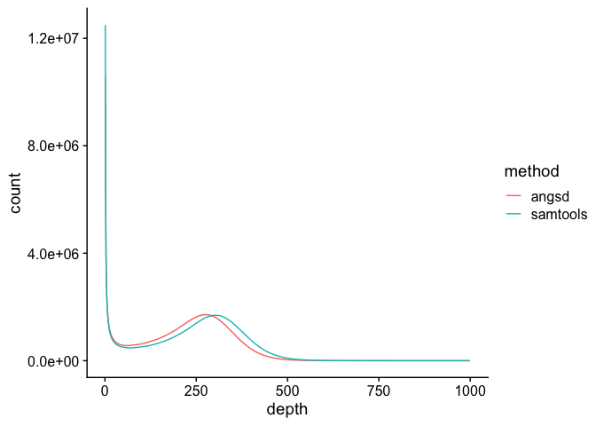
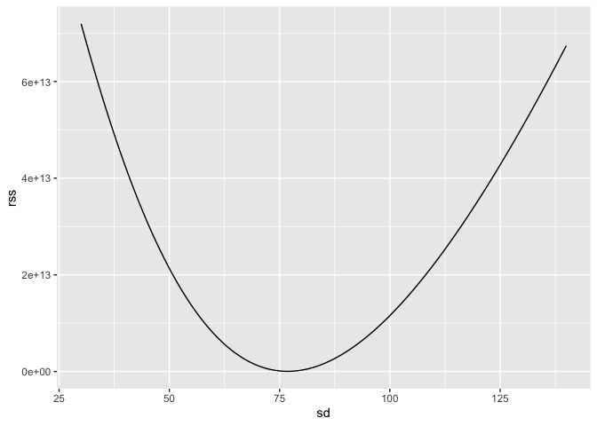
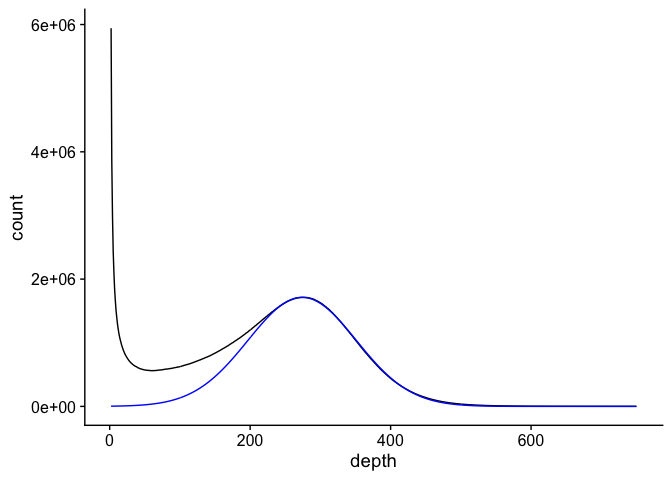
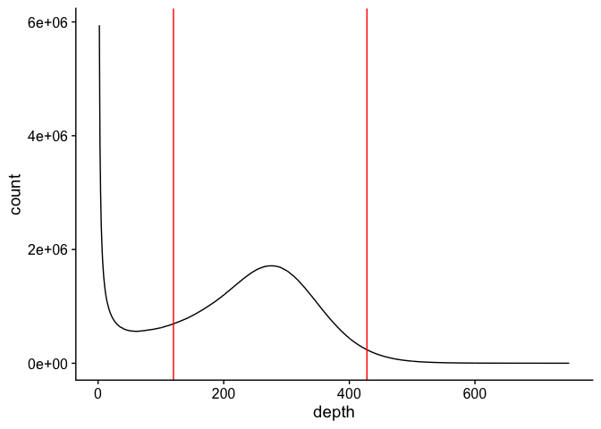
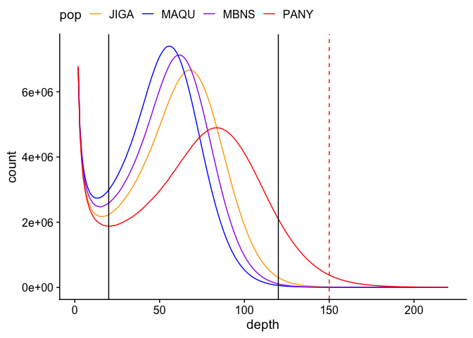

Generating data
================

-   [Establish SNP calling filters](#establish-snp-calling-filters)
-   [SNP calling](#snp-calling)
-   [Filtering](#filtering)
-   [Allele frequencies](#allele-frequencies)
-   [Folded SFS](#folded-sfs)
-   [PCA](#pca)
-   [FST](#fst)
-   [DXY](#dxy)
-   [Diversity](#diversity)
-   [LD](#ld)
-   [AFD](#afd)
-   [PCA on Inversion Regions](#pca-on-inversion-regions)
-   [Summarize recombination rates from brec into
    windows](#summarize-recombination-rates-from-brec-into-windows)
-   [Output bed file with region positions (centromeres, telomeres,
    inversions)](#output-bed-file-with-region-positions-centromeres-telomeres-inversions)
-   [Obtain exon densities from annotation and GC content from
    genome](#obtain-exon-densities-from-annotation-and-gc-content-from-genome)
-   [Summarize tandem repeat content from TRF and
    TRFparser](#summarize-tandem-repeat-content-from-trf-and-trfparser)
-   [Run bedtools intersect to obtain feature summaries in
    windows](#run-bedtools-intersect-to-obtain-feature-summaries-in-windows)
-   [Create dataframe with genome stats for 50kb
    windows](#create-dataframe-with-genome-stats-for-50kb-windows)
-   [Prepare input file of all population summary statistics from Angsd
    output](#prepare-input-file-of-all-population-summary-statistics-from-angsd-output)
-   [Combine genome feature and population genetic data
    frames](#combine-genome-feature-and-population-genetic-data-frames)

## Establish SNP calling filters

#### Count read depth per position

``` r
depth_hist_samtools <- read_delim("data_files/total_depth.txt", delim=" ") %>%
  rename(depth=total_depth, count=n) %>%
  mutate(method="samtools")

depth_hist_angsd <- read_lines("data_files/angsd.depthGlobal") %>%
  str_split(pattern = "\t") %>%
  .[[1]] %>%
  .[1:2001] %>%
  as.integer() %>%
  tibble(depth=0:2000, count=., method="angsd")

depth_hist_combined <- bind_rows(depth_hist_samtools, depth_hist_angsd)
```

#### Samtools vs ANGSD

<!-- -->

#### Find the standard deviation of the second peak by fitting the right part of it to a normal distribution

    ## # A tibble: 2 × 3
    ## # Groups:   method [2]
    ##   depth   count method  
    ##   <dbl>   <dbl> <chr>   
    ## 1   274 1713518 angsd   
    ## 2   302 1691673 samtools

    ## [1] "Optimal SD based on ANGSD: 77"

<!-- -->

#### Use two standard deviations from the mode as depth cutoffs

<!-- -->

    ## [1] "The fitted normal distribution matches the empricial depth distribution quite well."

    ## [1] "We will use its standard deviation, 77, to set up the depth filters"

    ## [1] "Max depth (mode+2sd): 428"

    ## [1] "Percent of all sites lost if max filter is used: 2.11"

    ## [1] "Percent of final mapped data will be lost if max filter is used: 4.78"

    ## [1] "Min depth (mode-2sd): 120"

    ## [1] "Percent of all sites lost if min filter is used: 23.19"

    ## [1] "Percent of final mapped data will be lost if min filter is used: 4.56"

<!-- -->

## SNP calling

BAM files: 42 populations with 4 individuals each (168 total samples)

BAM list: data\_files/bamlist42x4.txt

Reference genome: Mmenidia\_refgenome\_anchored.all\_renamed\_v2.fasta

Genome accession: GCA\_965154125.1

See script `/scripts/angsd_global_snp_calling_noCtrim.sh`

``` bash
/workdir/programs/angsd0.931/angsd/angsd \
 -b /workdir/maria/lowpops/bams/bamlist42x4.txt \
-ref /workdir/arne/ReferenceSeq/Mmenidia_refgenome_anchored.all_renamed_v2.fasta \
-out /workdir/maria/lowpops/angsd \
-GL 1 \                  # Use SAMtools genotype likelihood model
-doGlf 2 \               # Output genotype likelihoods in beagle format
-doMaf 1 \               # Calculate minor allele frequencies
-doMajorMinor 1 \        # Infer major and minor alleles from genotype likelihoods
-doCounts 1 \            # Calculate base counts
-doDepth 1 \             # Calculate depth
-maxDepth 10000 \        # Maximum depth limit (effectively no limit)
-dumpCounts 1 \          # Dump count data
-doIBS 1 \               # Calculate IBS matrix
-makematrix 1 \          # Make IBS matrix
-doCov 1 \               # Calculate covariance matrix
-SNP_pval 1e-6 \         # P-value threshold for SNP calling
-setMinDepth 120 \       # Minimum depth across all samples
-setMaxDepth 428 \       # Maximum depth across all samples
-minInd 84 \             # Minimum number of individuals (50% of total)
-minQ 20 \               # Minimum base quality
-minMapQ 20 \            # Minimum mapping quality
-minMaf 0.01 \           # Minimum minor allele frequency
-P 32 \                  # Use 32 threads
-remove_bads 1 \         # Remove reads with flags BAD_CIGAR or DUPLICATE
-only_proper_pairs 1 \   # Use only properly paired reads
-trim 0                  # No trimming of read ends
```

## Filtering

After the initial SNP calling, we created filtered SNP lists in various
formats required for downstream analyses.

``` bash
# Create main SNP list
gunzip -c angsd/angsd.mafs.gz | cut -f 1,2,3,4 | tail -n +2 > angsd/global_snp_list.txt

# Index the SNP list for ANGSD
/workdir/programs/angsd0.931/angsd/angsd sites index angsd/global_snp_list.txt

# Create regions format for the SNP list
cut -f 1,2 angsd/global_snp_list.txt | sed 's/\t/:/g' > angsd/global_snp_list.regions

# Extract list of chromosomes/scaffolds
cut -f1 angsd/global_snp_list.txt | sort | uniq > angsd/global_snp_list.chrs
```

We then generated genotype likelihoods for the filtered SNPs.

See script `/scripts/get_beagle.sh`

``` bash
nohup /workdir/programs/angsd0.931/angsd/angsd \
-b /workdir/maria/lowpops/bams/bamlist42x4.txt \
-anc /workdir/arne/ReferenceSeq/Mmenidia_refgenome_anchored.all_renamed_v2.fasta \
-out /workdir/maria/lowpops/angsd \
-GL 1 -doGlf 2 -doMaf 1 -doMajorMinor 3 \
-P 32 \
-sites /workdir/maria/lowpops/angsd/global_snp_list.txt \
-rf /workdir/maria/lowpops/angsd/global_snp_list.chrs \
>& get_beagle.log
```

We calculated depth per population.

``` bash
nohup /workdir/programs/angsd0.931/angsd/angsd -bam /workdir/maria/lowpops/sample_lists/bam_list_per_pop/bam_JIGA.txt -ref /workdir/arne/ReferenceSeq/Mmenidia_refgenome_anchored.all_renamed_v2.fasta -out /workdir/maria/lowpops/depth/pop/JIGA -GL 1 -doMajorMinor 1 -doMaf 1 -doDepth 1 -doCounts 1 -maxDepth 2000 -dumpCounts 1 -P 10 -minMapQ 20 -minQ 20 -remove_bads 1 -only_proper_pairs 1 -trim 0 >& JIGAdep.log

nohup /workdir/programs/angsd0.931/angsd/angsd -bam /workdir/maria/lowpops/sample_lists/bam_list_per_pop/bam_MAQU.txt -ref /workdir/arne/ReferenceSeq/Mmenidia_refgenome_anchored.all_renamed_v2.fasta -out /workdir/maria/lowpops/depth/pop/MAQU -GL 1 -doMajorMinor 1 -doMaf 1 -doDepth 1 -doCounts 1 -maxDepth 2000 -dumpCounts 1 -P 10 -minMapQ 20 -minQ 20 -remove_bads 1 -only_proper_pairs 1 -trim 0 >& MAQUdep.log

nohup /workdir/programs/angsd0.931/angsd/angsd -bam /workdir/maria/lowpops/sample_lists/bam_list_per_pop/bam_MBNS.txt -ref /workdir/arne/ReferenceSeq/Mmenidia_refgenome_anchored.all_renamed_v2.fasta -out /workdir/maria/lowpops/depth/pop/MBNS -GL 1 -doMajorMinor 1 -doMaf 1 -doDepth 1 -doCounts 1 -maxDepth 2000 -dumpCounts 1 -P 10 -minMapQ 20 -minQ 20 -remove_bads 1 -only_proper_pairs 1 -trim 0 >& MBNSdep.log
  
  
nohup /workdir/programs/angsd0.931/angsd/angsd -bam /workdir/maria/lowpops/sample_lists/bam_list_per_pop/bam_PANY.txt -ref /workdir/arne/ReferenceSeq/Mmenidia_refgenome_anchored.all_renamed_v2.fasta -out /workdir/maria/lowpops/depth/pop/PANY -GL 1 -doMajorMinor 1 -doMaf 1 -doDepth 1 -doCounts 1 -maxDepth 2000 -dumpCounts 1 -P 10 -minMapQ 20 -minQ 20 -remove_bads 1 -only_proper_pairs 1 -trim 0 >& PANYdep.log
```

``` r
depth_hist_pops <- read_tsv("data_files/depth_hist_pops.tsv")

filter(depth_hist_pops, depth>1, depth<=220) %>%
ggplot(aes(x=depth, y=count, color=pop)) + 
  geom_freqpoly(stat = "identity") +
  theme_cowplot()+
  theme(legend.position = "top") +
  scale_color_manual(values = c("orange","blue","purple", "red")) +
  geom_vline(xintercept = 20) +
  geom_vline(xintercept = 120) +
  geom_vline(xintercept = 150, color="red",linetype="dashed")
```

<!-- -->

## Allele frequencies

We calculated allele frequencies separately for each population using
the filtered SNP list.

See script `/scripts/get_maf_per_pop.sh`

``` bash
# For NY population with different depth parameters
nohup bash /workdir/genomic-data-analysis/scripts/get_maf_per_pop.sh \
/workdir/maria/lowpops/ \
/workdir/maria/lowpops/sample_lists/sample_tableNY.tsv \
5 \
bam_ \
/workdir/arne/ReferenceSeq/Mmenidia_refgenome_anchored.all_renamed_v2.fasta \
/workdir/maria/lowpops/angsd/global_snp_list.txt \
20 \
150 \
21 \
20 \
> /workdir/maria/lowpops/get_maf_NY.nohup &

# For the other three populations (GA, NS, QU)
nohup bash /workdir/maria/lowpops/scripts/get_maf_per_pop.sh \
/workdir/maria/lowpops/ \
/workdir/maria/lowpops/sample_lists/sample_table3pop.tsv \
5 \
bam_ \
/workdir/arne/ReferenceSeq/Mmenidia_refgenome_anchored.all_renamed_v2.fasta \
/workdir/maria/lowpops/angsd/global_snp_list.txt \
20 \
120 \
21 \
20 \
> /workdir/maria/lowpops/get_maf_3pop.nohup &
```

## Folded SFS

We generated folded site frequency spectra for each population
separately.

See script `/scripts/get_sfs_allsites_folded.sh`

``` bash
nohup sh ./get_sfs_allsites_folded.sh /workdir/maria/lowpops/sample_lists/bam_list_per_pop/bam_JIGA.txt JIGA /workdir/arne/ReferenceSeq/Mmenidia_refgenome_anchored.all_renamed_v2.fasta /workdir/maria/lowpops/angsd/summary_statistics/ _allsites_folded 21 20 120 > /workdir/maria/lowpops/nohups/jiga_folded_sfs_allsites_nohup.log &

nohup sh ./get_sfs_allsites_folded.sh /workdir/maria/lowpops/sample_lists/bam_list_per_pop/bam_PANY.txt PANY /workdir/arne/ReferenceSeq/Mmenidia_refgenome_anchored.all_renamed_v2.fasta /workdir/maria/lowpops/angsd/summary_statistics/ _allsites_folded 21 20 150 > /workdir/maria/lowpops/nohups/pany_folded_sfs_allsites_nohup.log &

nohup sh ./get_sfs_allsites_folded.sh /workdir/maria/lowpops/sample_lists/bam_list_per_pop/bam_MBNS.txt MBNS /workdir/arne/ReferenceSeq/Mmenidia_refgenome_anchored.all_renamed_v2.fasta /workdir/maria/lowpops/angsd/summary_statistics/ _allsites_folded 21 20 120 > /workdir/maria/lowpops/nohups/mbns_folded_sfs_allsites_nohup.log &

nohup sh ./get_sfs_allsites_folded.sh /workdir/maria/lowpops/sample_lists/bam_list_per_pop/bam_MAQU.txt MAQU /workdir/arne/ReferenceSeq/Mmenidia_refgenome_anchored.all_renamed_v2.fasta /workdir/maria/lowpops/angsd/summary_statistics/ _allsites_folded 21 20 120 > /workdir/maria/lowpops/nohups/maqu_folded_sfs_allsites_nohup.log &
```

## PCA

We performed population structure analysis using PCAngsd.

See script `/scripts/run_pcangsd.sh`

``` bash
nohup bash /workdir/genomic-data-analysis/scripts/run_pcangsd.sh \
/workdir/maria/lowpops/ \
/workdir/maria/lowpops/angsd.beagle.gz \
0.1 \
pca \
1 \
1 > path/output_logfile.nohup &
```

## FST

We calculalted FST for neighboring populations.

See script `/scripts/get_fst.sh`

``` bash
nohup ./get_fst.sh \
/workdir/maria/lowpops/angsd/popminind21/ \
/workdir/maria/lowpops/sample_lists/sample_tableGANY.tsv \
5 \
_global_snp_list_popminind21 \
> /workdir/maria/lowpops/get_fst_GANY.nohup &  
  
  
nohup ./get_fst.sh \
/workdir/maria/lowpops/angsd/popminind21/ \
/workdir/maria/lowpops/sample_lists/sample_tableNYNS.tsv \
5 \
_global_snp_list_popminind21 \
> /workdir/maria/lowpops/get_fst_NYNS.nohup &  
  
    
nohup ./get_fst.sh \
/workdir/maria/lowpops/angsd/popminind21/ \
/workdir/maria/lowpops/sample_lists/sample_tableNSQU.tsv \
5 \
_global_snp_list_popminind21 \
> /workdir/maria/lowpops/get_fst_NSQU.nohup &
```

We averaged FST in 50kb windows.

``` r
fst_JIGA_PANY <- read_tsv("JIGA_PANY_global_snp_list_popminind21.fst", col_names = c("lg", "pos", "alpha",  "beta", "fst")) %>%
  filter(grepl('Mme', lg)) %>%
  mutate(lg=as.numeric(str_remove(lg, "Mme_chr"))) %>% arrange(lg,pos)


fst_MBNS_PANY <- read_tsv("MBNS_PANY_global_snp_list_popminind21.fst", col_names = c("lg", "pos", "alpha",  "beta", "fst")) %>%
  filter(grepl('Mme', lg)) %>%
  mutate(lg=as.numeric(str_remove(lg, "Mme_chr"))) %>% arrange(lg,pos)


fst_MAQU_MBNS <- read_tsv("MAQU_MBNS_global_snp_list_popminind21.fst", col_names = c("lg", "pos", "alpha",  "beta", "fst")) %>%
  filter(grepl('Mme', lg))%>%
  mutate(lg=as.numeric(str_remove(lg, "Mme_chr"))) %>% arrange(lg,pos)


fst_JIGA_PANY %>% summarise(avgfst=sum(alpha)/sum(beta))
fst_MBNS_PANY %>% summarise(avgfst=sum(alpha)/sum(beta))
fst_MAQU_MBNS %>% summarise(avgfst=sum(alpha)/sum(beta))


fixed_windowed_fst <- function(x, window_length){
  mutate(x, pos=cut(pos, breaks=seq(0,50*10^6,window_length), labels=seq(window_length/2,50*10^6-window_length/2,window_length))) %>%
  group_by(lg, pos) %>%
  summarise(fst=sum(alpha)/sum(beta)) %>%
  mutate(pos=as.numeric(as.character(pos)))
}

fst_JIGA_PANY_win50kb <- fixed_windowed_fst(fst_JIGA_PANY, 50000)
write_tsv(fst_JIGA_PANY_win50kb,"data_files/fst_JIGA_PANY_win50kb.txt")

fst_MBNS_PANY_win50kb <- fixed_windowed_fst(fst_MBNS_PANY, 50000)
write_tsv(fst_MBNS_PANY_win50kb,"data_files/fst_MBNS_PANY_win50kb.txt")

fst_MAQU_MBNS_win50kb <- fixed_windowed_fst(fst_MAQU_MBNS, 50000)
write_tsv(fst_MAQU_MBNS_win50kb,"data_files/fst_MAQU_MBNS_win50kb.txt")
```

## DXY

We calculated SAF files for each population within 50kb windows.

See script `/scripts/get_saf_windows.sh`

``` bash
# Convert window BED file to ANGSD-compatible format
awk '{print $1"\t"$2+1"\t"$3}' /workdir/maria/lowpops/gene/temp.CalculateGDWindows.50.intervals.bed > window50k.bed

# Create regions format file for ANGSD
awk '{print $1":"$2"-"$3}' window50k.bed > window50k.rf


# Generate SAF for Jekyll Island, Georgia (JIGA)
nohup sh ./get_saf_windows.sh \
/workdir/maria/lowpops/sample_lists/bam_list_per_pop/bam_JIGA.txt \
JIGA \
/workdir/arne/ReferenceSeq/Mmenidia_refgenome_anchored.all_renamed_v2.fasta \
/workdir/maria/lowpops/angsd/dxy/ \
_saf_50kb \
/workdir/arne/ReferenceSeq/Mmenidia_refgenome_anchored.all_renamed_v2.fasta.fai \
/workdir/maria/lowpops/angsd/dxy/window50k.rf \
> /workdir/maria/lowpops/nohups/jiga_saf_50kwin_nohup.log &

# Generate SAF for Patchogue, New York (PANY)
nohup sh ./get_saf_windows.sh \
/workdir/maria/lowpops/sample_lists/bam_list_per_pop/bam_PANY.txt \
PANY \
/workdir/arne/ReferenceSeq/Mmenidia_refgenome_anchored.all_renamed_v2.fasta \
/workdir/maria/lowpops/angsd/dxy/ \
_saf_50kb \
/workdir/arne/ReferenceSeq/Mmenidia_refgenome_anchored.all_renamed_v2.fasta.fai \
/workdir/maria/lowpops/angsd/dxy/window50k.rf \
> /workdir/maria/lowpops/nohups/pany_saf_50kwin_nohup.log &

# Generate SAF for Minas Basin, Nova Scotia (MBNS)
nohup sh ./get_saf_windows.sh \
/workdir/maria/lowpops/sample_lists/bam_list_per_pop/bam_MBNS.txt \
MBNS \
/workdir/arne/ReferenceSeq/Mmenidia_refgenome_anchored.all_renamed_v2.fasta \
/workdir/maria/lowpops/angsd/dxy/ \
_saf_50kb \
/workdir/arne/ReferenceSeq/Mmenidia_refgenome_anchored.all_renamed_v2.fasta.fai \
/workdir/maria/lowpops/angsd/dxy/window50k.rf \
> /workdir/maria/lowpops/nohups/mbns_saf_50kwin_nohup.log &

# Generate SAF for Magdalen Island, Quebec (MAQU)
nohup sh ./get_saf_windows.sh \
/workdir/maria/lowpops/sample_lists/bam_list_per_pop/bam_MAQU.txt \
MAQU \
/workdir/arne/ReferenceSeq/Mmenidia_refgenome_anchored.all_renamed_v2.fasta \
/workdir/maria/lowpops/angsd/dxy/ \
_saf_50kb \
/workdir/arne/ReferenceSeq/Mmenidia_refgenome_anchored.all_renamed_v2.fasta.fai \
/workdir/maria/lowpops/angsd/dxy/window50k.rf \
> /workdir/maria/lowpops/nohups/maqu_saf_50kwin_nohup.log &
```

We calculated the 2D-SFS between neighboring populations.

``` bash
# Function for GA vs NY comparison
rsfs_gany(){
    /workdir/programs/angsd0.931/angsd/misc/realSFS JIGA_saf_50kb.saf.idx PANY_saf_50kb.saf.idx -r $1 -P 1 -fold 1 > JIGA.PANY50kb.${1}.sfs
}

# Function for NY vs NS comparison
rsfs_nyns(){
    /workdir/programs/angsd0.931/angsd/misc/realSFS PANY_saf_50kb.saf.idx MBNS_saf_50kb.saf.idx -r $1 -P 1 -fold 1 > PANY.MBNS50kb.${1}.sfs
}

# Function for NS vs QU comparison
rsfs_nsqu(){
    /workdir/programs/angsd0.931/angsd/misc/realSFS MBNS_saf_50kb.saf.idx MAQU_saf_50kb.saf.idx -r $1 -P 1 -fold 1 > MBNS.MAQU50kb.${1}.sfs
}

# Export the functions
export -f rsfs_gany
export -f rsfs_nyns
export -f rsfs_nsqu

# Run all three population comparisons in parallel
parallel --bar -j 40 -a window50k.rf rsfs_gany
parallel --bar -j 40 -a window50k.rf rsfs_nyns
parallel --bar -j 40 -a window50k.rf rsfs_nsqu

# Merge the results for each comparison
cat JIGA.PANY50kb.*.sfs > JIGA.PANY.50kb.2dsfs
cat PANY.MBNS50kb.*.sfs > PANY.MBNS.50kb.2dsfs
cat MBNS.MAQU50kb.*.sfs > MBNS.MAQU.50kb.2dsfs
```

We calculated dxy in 50kb windows between neighboring populations.

``` bash
# Calculate Dxy for GA-NY comparison
python3 /scripts/dxy_wsfs.py -w JIGA.PANY.50kb.2dsfs -m 42 -n 42 -o GANY_50kb_dxy.txt

# Calculate Dxy for NY-NS comparison
python3 /scripts/dxy_wsfs.py -w PANY.MBNS.50kb.2dsfs -m 42 -n 42 -o NYNS_50kb_dxy.txt

# Calculate Dxy for NS-QU comparison
python3 /scripts/dxy_wsfs.py -w MBNS.MAQU.50kb.2dsfs -m 42 -n 42 -o NSQU_50kb_dxy.txt
```

## Diversity

We calculated theta (+ pi) in 50kb windows per population.

See script `/scripts/get_thetastats_win.sh` and
`/scripts/get_theta_per_pop.sh`

``` bash
nohup sh ./get_thetastats_win.sh /workdir/maria/lowpops/sample_lists/bam_list_per_pop/bam_JIGA.txt JIGA /workdir/arne/ReferenceSeq/Mmenidia_refgenome_anchored.all_renamed_v2.fasta /workdir/maria/lowpops/angsd/summary_statistics/JIGA_allsites_folded.saf.idx /workdir/maria/lowpops/angsd/summary_statistics/ _allsites_thetastats 25000 25000 > /workdir/maria/lowpops/nohups/jiga_thetastats_folded_nohup.log & 
  
nohup sh ./get_thetastats_win.sh /workdir/maria/lowpops/sample_lists/bam_list_per_pop/bam_PANY.txt PANY /workdir/arne/ReferenceSeq/Mmenidia_refgenome_anchored.all_renamed_v2.fasta /workdir/maria/lowpops/angsd/summary_statistics/PANY_allsites_folded.saf.idx /workdir/maria/lowpops/angsd/summary_statistics/ _allsites_thetastats 25000 25000 > /workdir/maria/lowpops/nohups/pany_thetastats_folded_nohup.log &
  
nohup sh ./get_thetastats_win.sh /workdir/maria/lowpops/sample_lists/bam_list_per_pop/bam_MBNS.txt MBNS /workdir/arne/ReferenceSeq/Mmenidia_refgenome_anchored.all_renamed_v2.fasta /workdir/maria/lowpops/angsd/summary_statistics/MBNS_allsites_folded.saf.idx /workdir/maria/lowpops/angsd/summary_statistics/ _allsites_thetastats 25000 25000 > /workdir/maria/lowpops/nohups/mbns_thetastats_folded_nohup.log &
  
  
nohup sh ./get_thetastats_win.sh /workdir/maria/lowpops/sample_lists/bam_list_per_pop/bam_MAQU.txt MAQU /workdir/arne/ReferenceSeq/Mmenidia_refgenome_anchored.all_renamed_v2.fasta /workdir/maria/lowpops/angsd/summary_statistics/MAQU_allsites_folded.saf.idx /workdir/maria/lowpops/angsd/summary_statistics/ _allsites_thetastats 25000 25000 > /workdir/maria/lowpops/nohups/maqu_thetastats_folded_nohup.log &
  
  
nohup /workdir/programs/angsd0.931/angsd/misc/thetaStat do_stat /workdir/maria/lowpops/angsd/summary_statistics/MAQU_allsites_thetastats.thetas.idx -win 50000 -step 50000 -outnames /workdir/maria/lowpops/angsd/summary_statistics/MAQU_allsites_thetastats_theta.thetas50Window.gz > /workdir/maria/lowpops/nohups/maqu_thetastats_50_nohup.log &
  
nohup /workdir/programs/angsd0.931/angsd/misc/thetaStat do_stat /workdir/maria/lowpops/angsd/summary_statistics/MBNS_allsites_thetastats.thetas.idx -win 50000 -step 50000 -outnames /workdir/maria/lowpops/angsd/summary_statistics/MBNS_allsites_thetastats_theta.thetas50Window.gz > /workdir/maria/lowpops/nohups/mbns_thetastats_50_nohup.log &
  
nohup /workdir/programs/angsd0.931/angsd/misc/thetaStat do_stat /workdir/maria/lowpops/angsd/summary_statistics/PANY_allsites_thetastats.thetas.idx -win 50000 -step 50000 -outnames /workdir/maria/lowpops/angsd/summary_statistics/PANY_allsites_thetastats_theta.thetas50Window.gz > /workdir/maria/lowpops/nohups/pany_thetastats_50_nohup.log &
  
nohup /workdir/programs/angsd0.931/angsd/misc/thetaStat do_stat /workdir/maria/lowpops/angsd/summary_statistics/JIGA_allsites_thetastats.thetas.idx -win 50000 -step 50000 -outnames /workdir/maria/lowpops/angsd/summary_statistics/JIGA_allsites_thetastats_theta.thetas50Window.gz > /workdir/maria/lowpops/nohups/jiga_thetastats_50_nohup.log &
```

## LD

We calculated LD per population.

``` bash
nohup /workdir/maria/lowpops/ngsLD/ngsLD \
--geno /workdir/maria/lowpops/angsd/popminind21/MAQU_global_snp_list_popminind21_downsampled.beagle.gz \
--pos /workdir/maria/lowpops/angsd/popminind21/MAQU_global_snp_list_popminind21.downsampled.txt.gz \
--n_ind 42 \
--n_sites 1596556 \
--out /workdir/maria/lowpops/angsd/LD/MAQU50kb.ld \
--max_kb_dist 50 \
--max_snp_dist 100 \
--n_threads 20 \
--probs \
> /workdir/maria/lowpops/nohups/MAQU_ngsLD_50kb_estimates_nohup.log &

sed -i 's/:/\t/g' MAQU50kb.ld

awk '{a=int(($2+$4)/2+0.5); $3=a;print}' MAQU50kb.ld > MAQU50kbavg.ld

rm MAQU50kb.ld


nohup /workdir/maria/lowpops/ngsLD/ngsLD \
--geno /workdir/maria/lowpops/angsd/popminind21/MBNS_global_snp_list_popminind21_downsampled.beagle.gz \
--pos /workdir/maria/lowpops/angsd/popminind21/MBNS_global_snp_list_popminind21.downsampled.txt.gz \
--n_ind 42 \
--n_sites 1981576 \
--out /workdir/maria/lowpops/angsd/LD/MBNS50kb.ld \
--max_kb_dist 50 \
--max_snp_dist 100 \
--n_threads 20 \
--probs \
> /workdir/maria/lowpops/nohups/MBNS_ngsLD_50kb_estimates_nohup.log &
  
sed -i 's/:/\t/g' MBNS50kb.ld

awk '{a=int(($2+$4)/2+0.5); $3=a;print}' MBNS50kb.ld > MBNS50kbavg.ld

rm MBNS50kb.ld
  
  
nohup /workdir/maria/lowpops/ngsLD/ngsLD \
--geno /workdir/maria/lowpops/angsd/popminind21/PANY_global_snp_list_popminind21_downsampled.beagle.gz \
--pos /workdir/maria/lowpops/angsd/popminind21/PANY_global_snp_list_popminind21.downsampled.txt.gz \
--n_ind 42 \
--n_sites 2455698 \
--out /workdir/maria/lowpops/angsd/LD/PANY50kb.ld \
--max_kb_dist 50 \
--max_snp_dist 100 \
--n_threads 20 \
--probs \
> /workdir/maria/lowpops/nohups/PANY_ngsLD_50kb_estimates_nohup.log &

sed -i 's/:/\t/g' PANY50kb.ld
  
awk '{a=int(($2+$4)/2+0.5); $3=a;print}' PANY50kb.ld > PANY50kbavg.ld
  
rm PANY50kb.ld    
  
nohup /workdir/maria/lowpops/ngsLD/ngsLD \
--geno /workdir/maria/lowpops/angsd/popminind21/JIGA_global_snp_list_popminind21_downsampled.beagle.gz \
--pos /workdir/maria/lowpops/angsd/popminind21/JIGA_global_snp_list_popminind21.downsampled.txt.gz \
--n_ind 42 \
--n_sites 2279533 \
--out /workdir/maria/lowpops/angsd/LD/JIGA50kb.ld \
--max_kb_dist 50 \
--max_snp_dist 100 \
--n_threads 20 \
--probs \
> /workdir/maria/lowpops/nohups/JIGA_ngsLD_50kb_estimates_nohup.log &
  
sed -i 's/:/\t/g' JIGA50kb.ld

awk '{a=int(($2+$4)/2+0.5); $3=a;print}' JIGA50kb.ld > JIGA50kbavg.ld

rm JIGA50kb.ld
  
```

We averaged LD in 50kb windows.

## AFD

We calculated allele frequency deviation (AFD) as an FST alternative.

``` r
jiga <- read_delim("JIGA_global_snp_list_popminind21.mafs.gz",delim = "\t", col_names = T, col_types = list(chromo = col_character() ))

pany <- read_delim("PANY_global_snp_list_popminind21.mafs.gz", delim = "\t", col_names = T, col_types = list(chromo = col_character() ))

mbns <- read_delim("MBNS_global_snp_list_popminind21.mafs.gz", delim = "\t", col_names = T, col_types = list(chromo = col_character() ))

maqu <- read_delim("MAQU_global_snp_list_popminind21.mafs.gz", delim = "\t", col_names = T, col_types = list(chromo = col_character() ))


MAF.df <- inner_join(jiga,pany, by=c("chromo", "position"), suffix=c(".jiga",".pany"))

MAFdf2 <- MAF.df %>% inner_join(mbns, by=c("chromo", "position")) %>% inner_join(maqu, by=c("chromo", "position"), suffix=c(".mbns",".maqu"))

        
                                                                                                  
AFD <- function(x,y) ((abs(x-y) + abs((1-x)-(1-y)) )/2)

deltaAF <- function(x,y) x-y

allMAF <- MAFdf2 %>% 
  mutate(AFDGANY=AFD(knownEM.jiga, knownEM.pany), 
         AFDNYNS=AFD(knownEM.pany,knownEM.mbns), 
         AFDNSQU=AFD(knownEM.mbns,knownEM.maqu)) %>% 
  mutate(dafGANY=deltaAF(knownEM.jiga, knownEM.pany), 
         dafNYNS=deltaAF(knownEM.pany,knownEM.mbns), 
         dafNSQU=deltaAF(knownEM.mbns,knownEM.maqu)) %>% 
  filter(nInd.jiga>=21 & nInd.pany>=21 & nInd.mbns>=21 & nInd.maqu>=21) %>% 
  select(chromo,position,AFDGANY, AFDNYNS, AFDNSQU,dafGANY,dafNYNS,dafNSQU)


AFDs <- allMAF %>% 
  filter(grepl('Mme', chromo)) %>% 
  group_by(chromo) %>%
  mutate(window = cut(position, breaks=seq(0,max(position)+50000,by=50000))) 

avgAFDsDAFs <-  AFDs %>% group_by(chromo, window) %>% 
  summarise(afdGANY=mean(AFDGANY), afdNYNS=mean(AFDNYNS), afdNSQU=mean(AFDNSQU), dafGANY=mean(dafGANY), dafNYNS=mean(dafNYNS), dafNSQU=mean(dafNSQU))

write_tsv(avgAFDsDAFs, "window50/avgAFDsDAFs.txt")
```

## PCA on Inversion Regions

Do based on inversion regions in `/data_files/regions.txt`

``` bash
#!/bin/bash

# Input files and paths
REGION_TABLE="/workdir/maria/lowpops/angsd/inv_pca/regions.txt"  # Contains the chr, start, and end columns
BEAGLE_FILE="/workdir/maria/lowpops/angsd/angsd.beagle.gz"
OUTPUT_DIR="/workdir/maria/lowpops/angsd/inv_pca"

# Ensure the output directory exists
mkdir -p $OUTPUT_DIR

# Loop through each region in the table, skipping the header
tail -n +2 "$REGION_TABLE" | while IFS=$'\t' read -r CHR START END; do
    # Add leading zero for single-digit chromosomes
    if [ "$CHR" -lt 10 ]; then
        CHR="0$CHR"
    fi

    echo "Processing region: chr$CHR:$START-$END"

    # Extract relevant region
    zcat $BEAGLE_FILE | awk -v chr="$CHR" -v start="$START" -v end="$END" '
    $1 == "marker" || 
    ($1 ~ "^Mme_chr" chr "_" && (match($1, /[0-9]+$/, arr) && arr[0] >= start && arr[0] <= end))
    ' | gzip > "$OUTPUT_DIR/chr${CHR}_${START}_${END}.beagle.gz"

    # Check if the file was created successfully
    if [ -f "$OUTPUT_DIR/chr${CHR}_${START}_${END}.beagle.gz" ]; then
        echo "File created: $OUTPUT_DIR/chr${CHR}_${START}_${END}.beagle.gz"
    else
        echo "Error: Failed to create file for region chr$CHR:$START-$END"
    fi
done

echo "Beagle file generation completed!"
```

Run PCAngsd on inversion beagle files.

``` bash
#!/bin/bash

# Input and output paths
WORK_DIR="/workdir/maria/lowpops/angsd/inv_pca"  # Directory containing both Beagle files and output PCA files

# Loop through each .beagle.gz file in the directory
for BEAGLE_FILE in "$WORK_DIR"/*.beagle.gz; do
    REGION_NAME=$(basename "$BEAGLE_FILE" .beagle.gz)
    echo "Running PCAngsd on $REGION_NAME"

    # Run PCAngsd
    nohup python2 /workdir/programs/pcangsd/pcangsd.py \
        -beagle "$BEAGLE_FILE" \
        -minMaf 0.1 \
        -threads 16 \
        -o "$WORK_DIR/${REGION_NAME}" \
        > "$WORK_DIR/${REGION_NAME}.nohup" &

done

# Wait for all PCAngsd jobs to finish
wait
echo "PCAngsd analyses completed!"
```

Combine inversion PCA outputs.

``` r
library(tidyverse)
library(RcppCNPy)
library(scales)

# Input and output paths
work_dir <- "/workdir/maria/lowpops/angsd/inv_pca"
sample_list_path <- "/workdir/maria/lowpops/sample_lists/sample_list.txt"
output_file <- file.path(work_dir, "combined_pca_results.txt")

# Read sample labels (no header)
pop_label <- read_tsv(sample_list_path, col_names = FALSE) %>%
  rename(population = X1)  # Rename the single column to 'population'

# List all covariance files
cov_files <- list.files(work_dir, pattern = "\\.cov\\.npy$", full.names = TRUE)

# Initialize an empty list to store results
pca_results <- list()

# Process each covariance file
for (cov_file in cov_files) {
  # Extract region name from file name
  region_name <- str_replace(basename(cov_file), "\\.cov\\.npy$", "")
  chr_start_end <- str_match(region_name, "chr(\\d+)_(\\d+)_(\\d+)")[, 2:4]
  
  # Load covariance matrix
  cov_matrix <- npyLoad(cov_file) %>% as.matrix()
  
  # Perform PCA
  e <- eigen(cov_matrix)
  e_values <- e$values
  e_vectors <- as.data.frame(e$vectors)[, 1:5]
  
  # Compute variance explained
  x_variance <- e_values[1] / sum(e_values) * 100
  y_variance <- e_values[2] / sum(e_values) * 100
  
  # Create PCA table
  pca_table <- bind_cols(
    population = pop_label$population,  # Use the single column from pop_label
    e_vectors
  ) %>%
    transmute(
      population = population,
      PC1 = rescale(V1, c(-1, 1)),
      PC2 = rescale(V2, c(-1, 1)),
      PC3 = rescale(V3, c(-1, 1)),
      PC4 = rescale(V4, c(-1, 1)),
      PC5 = rescale(V5, c(-1, 1)),
      chr = chr_start_end[1],
      start = chr_start_end[2],
      end = chr_start_end[3]
    )
  
  # Add to results list
  pca_results[[region_name]] <- pca_table
}

# Combine all results into a single data frame
combined_pca_results <- bind_rows(pca_results)

# Write to file
write.table(combined_pca_results, output_file, col.names = TRUE, row.names = FALSE, quote = FALSE, sep = "\t")

cat("Combined PCA results saved to", output_file, "\n")
```

## Summarize recombination rates from brec into windows

``` r
recomb <- read_delim("plot_files/input/recomb_df_015.txt", delim = " ")

rrwin <- recomb %>% 
  arrange(map,mb) %>% 
  group_by(map) %>%
  mutate(window = cut(mb, breaks=seq(0,max(mb)+0.05,by=0.05))) %>%
  ungroup() %>% 
  separate(window, c('col1', 'col2'), sep = ",") %>%
  mutate(col1=as.numeric(str_replace_all(col1, "[//(//)]", "")))%>%
  mutate(col2=as.numeric(str_replace_all(col2, "\\[|\\]", "")))

rrwin %>% dplyr::select(map,col1,col2,regDr) %>% dplyr::rename("recombNY"="regDr") %>% 
  mutate(col1=as.integer(col1*1e6), col2=as.integer(col2*1e6)) %>% group_by(map,col1,col2) %>% summarize(avgrr=mean(recombNY)) %>% write_tsv("window50/recombNY.tsv")

rrwin %>% dplyr::select(map,col1,col2,regDr) %>% dplyr::rename("recombGA"="regDr") %>% 
  mutate(col1=as.integer(col1*1e6), col2=as.integer(col2*1e6)) %>% group_by(map,col1,col2) %>% summarize(avgrr=mean(recombGA)) %>% write_tsv("window50/recomb.tsv")

rrwin %>% dplyr::select(map,col1,col2,regDr) %>% dplyr::rename("recombF1"="regDr") %>% 
  mutate(col1=as.integer(col1*1e6), col2=as.integer(col2*1e6)) %>% group_by(map,col1,col2) %>% summarize(avgrr=mean(recombF1)) %>% write_tsv("window50/recombF1.tsv")
```

## Output bed file with region positions (centromeres, telomeres, inversions)

``` r
telcen <- read_tsv("window50/fintelcen.tsv") %>% 
  mutate(chromosome=
           case_when(chr<10 ~ str_c("Mme_chr0",chr),
                     TRUE ~ paste0("Mme_chr",chr)))


telo_cen <- telcen %>% dplyr::rename("start_r"="value_start_telor",
                                     "end_r"="value_end_telor",
                                     "start_l"="value_start_telol",
                                     "end_l"="value_end_telol",
                                     "start_cV"="value_start_cV",
                                     "end_cV"="value_end_cV") %>% select(-chromosome)

write_tsv(telo_cen,"window50/alltelocentro.tsv")

telstart <- telcen %>% dplyr::select(chromosome,value_start_telor,value_start_telol) %>% pivot_longer(-chromosome, values_to="start") %>% dplyr::select(chromosome,start)

telend <- telcen %>% select(chromosome,value_end_telor,value_end_telol) %>% pivot_longer(-chromosome, values_to="end") %>% select(end)

telj <- bind_cols(telstart,telend)

inversions <- read_tsv(file = "plot_files/input/arne_inv_new.tsv") %>% 
  mutate(region="inversion") %>% 
  filter(!(chr==18 & start==8508524)) %>% 
  filter(!(chr==19 & start==3482194)) %>% 
  filter(!(chr==24 & start==12760364))

write_tsv(telj, "telos.bed",col_names = F)

telcen %>% dplyr::select(chromosome,value_start_cV,value_end_cV) %>% 
  drop_na() %>% mutate(value_start_cV=as.integer(value_start_cV),
                       value_end_cV=as.integer(value_end_cV)) %>% 
  write_tsv("centro.bed",col_names = F)

inversions %>% mutate(chr=case_when(
    chr < 10 ~ paste0("Mme_chr0",chr),
    TRUE ~ paste0("Mme_chr", chr))) %>% select(chr,start,end) %>%
  write_tsv("inv15.bed", col_names = F)
```

## Obtain exon densities from annotation and GC content from genome

``` bash
bedtools makewindows -g chrom_size.txt -w 50000 | bedtools sort -i - > temp.CalculateGDWindows.50.intervals.bed


## get positions of exons from genome annotation 

grep -v "^#" mme_annotation_anchored_genome_final_clean.noseq.gff | awk '($3 == "exon") {print $1"\t"$4"\t"$5}' | bedtools sort -i - | bedtools merge -i - > temp.CalculateGDWindows.exons.bed


## calculate GC content using reference genome

bedtools makewindows -g chrom_size.txt -w 50000 | bedtools nuc -fi /workdir/arne/ReferenceSeq/Mmenidia_refgenome_anchored.all_renamed_v2.fasta -bed - | cut -f1-3,5 | tail -n +2 - > gc50kb.txt
```

## Summarize tandem repeat content from TRF and TRFparser

[TRF](https://tandem.bu.edu/trf/trf_on_github)

[TRFparser](https://sourceforge.net/projects/trfparser/files/trf_parser/)

``` r
trf_output <- read_tsv("trf/Mmenidia_refgenome_anchored.all_renamed_v2.fasta.2.7.7.80.10.50.500.final.parse")

numbs <- read_csv("trf/charvect.csv") %>% rename("chr"=x)

reppar <- bind_cols(numbs,trf_output) %>% arrange(chr,rep_start) %>% 
  mutate(midpoint=(rep_start+rep_end)/2) 

repwin <- reppar %>% 
  group_by(chr) %>%
  mutate(window = cut(midpoint, breaks=seq(0,max(midpoint)+50000,by=50000))) %>%
  separate(window, c('col1', 'col2'), sep = ",") %>%
  mutate(col1=as.numeric(str_replace_all(col1, "[//(//)]", "")))%>%
  mutate(col2=as.numeric(str_replace_all(col2, "\\[|\\]", ""))) %>%
  ungroup()


windowsr <- read_tsv("window50/temp.CalculateGDWindows.50.intervals.bed", col_names = c("chr","col1","col2")) %>% mutate(chr=as.numeric(str_remove(chr, "Mme_chr")))

repwinsum <- repwin %>% group_by(chr,col1,col2) %>% 
  summarise(reps=n(), size=mean(pattern_size), at_per=mean(a_percent+t_percent))

rep_windows <- left_join(windowsr,repwinsum, by=c("chr", "col1", "col2"))

write_tsv(rep_windows, "window50/repwindows.txt")
```

## Run bedtools intersect to obtain feature summaries in windows

``` bash
bedtools intersect -a temp.CalculateGDWindows.50.intervals.bed -b centro.bed -wao > wincen.bed

bedtools intersect -a temp.CalculateGDWindows.50.intervals.bed -b telos.bed -wao > wintel.bed

bedtools intersect -a temp.CalculateGDWindows.50.intervals.bed -b inversions.bed -wao > wininv.bed

bedtools intersect -a temp.CalculateGDWindows.50.intervals.bed -b temp.CalculateGDWindows.exons.bed -wao | \
awk -v window_size=50000 '{count[$1"\t"$2"\t"$3]+=$7}END {for ( i in count) print i"\t"count[i] / window_size}' | \
bedtools sort -i - | sed -e 's/,/./g' | awk '{print $1"\t"$2"\t"$3"\t"$4}' - > exon_densities50kb.txt
```

## Create dataframe with genome stats for 50kb windows

``` r
windows <- read_tsv("window50/temp.CalculateGDWindows.50.intervals.bed", col_names = c("chromosome","col1","col2")) %>% mutate(chromosome=as.numeric(str_remove(chromosome, "Mme_chr")))

recomb <- read_tsv("window50/recomb.tsv") %>% dplyr::rename("chromosome"="map")

recombNY <- read_tsv("window50/recombNY.tsv") %>% dplyr::rename("chromosome"="map", "avgrrNY"="avgrr")

recombF1 <- read_tsv("window50/recombF1.tsv") %>% dplyr::rename("chromosome"="map", "avgrrF1"="avgrr")

gc <- read_tsv("window50/gc50kb.txt", col_names = c("chromosome","col1","col2","gc")) %>% 
  mutate(chromosome=as.numeric(str_remove(chromosome, "Mme_chr")))

exond <- read_tsv("window50/exon_densities50kb.txt", col_names = c("chromosome","col1","col2","exond")) %>% 
  mutate(chromosome=as.numeric(str_remove(chromosome, "Mme_chr")))

telom <- read_tsv("window50/wintel.bed", col_names = c("chromosome","col1","col2","chrom","tel_start","tel_end","tel_overlap")) %>% 
  mutate(chromosome=as.numeric(str_remove(chromosome, "Mme_chr"))) %>% mutate(in_telo=case_when(chrom=="." ~ "no", TRUE ~ "telomere")) %>% 
  dplyr::select(chromosome,col1,col2,in_telo)

centrom <- read_tsv("window50/wincen.bed", col_names = c("chromosome","col1","col2","chrom","cen_start","cen_end","cen_overlap")) %>% 
  mutate(chromosome=as.numeric(str_remove(chromosome, "Mme_chr"))) %>% mutate(in_centro=case_when(chrom=="." ~ "no", TRUE ~ "centromere")) %>%
  dplyr::select(chromosome,col1,col2,in_centro)

invwin <- read_tsv("window50/wininv15.bed", col_names = c("chromosome","col1","col2","chrom","inv_start","inv_end","inv_overlap")) %>% 
  mutate(chromosome=as.numeric(str_remove(chromosome, "Mme_chr"))) %>% mutate(in_inv=case_when(chrom=="." ~ "no", TRUE ~ "inversion")) %>% 
  dplyr::select(chromosome,col1,col2,in_inv) %>% unique()

genfeat <-plyr::join_all(list(windows,recomb,recombNY,recombF1,gc,exond, telom,centrom,invwin), by=c("chromosome","col1","col2"), type='left')
```

## Prepare input file of all population summary statistics from Angsd output

``` r
windows <- read_tsv("window50/temp.CalculateGDWindows.50.intervals.bed", col_names = c("chromosome","col1","col2")) %>% mutate(chromosome=as.numeric(str_remove(chromosome, "Mme_chr")))

fst_JIGA_PANY <- read_tsv("data_files/fst_JIGA_PANY_win50kb.txt", col_names = c("lg", "pos", "fst")) %>%
  filter(grepl('Mme', lg)) %>%
  mutate(lg=as.numeric(str_remove(lg, "Mme_chr")), pos=as.numeric(pos)) %>% arrange(lg,pos)

fst_MBNS_PANY <- read_tsv("data_files/fst_MBNS_PANY_win50kb.txt", col_names = c("lg", "pos", "fst")) %>%
  filter(grepl('Mme', lg)) %>%
  mutate(lg=as.numeric(str_remove(lg, "Mme_chr")), pos=as.numeric(pos)) %>% arrange(lg,pos)

fst_MAQU_MBNS <- read_tsv("data_files/fst_MAQU_MBNS_win50kb.txt", col_names = c("lg", "pos", "fst"))%>%
  filter(grepl('Mme', lg)) %>%
  mutate(lg=as.numeric(str_remove(lg, "Mme_chr")), pos=as.numeric(pos)) %>% arrange(lg,pos)

sfst_MAQU_MBNS <- fst_MAQU_MBNS %>% mutate(col2=pos+25000, fst=as.numeric(fst)) %>% 
  dplyr::rename("chromosome"=lg) %>% mutate(col1=col2-50000) %>% dplyr::rename("fstNSQU"="fst") %>% dplyr::select(-pos)
sfst_JIGA_PANY <- fst_JIGA_PANY %>% mutate(col2=pos+25000, fst=as.numeric(fst)) %>% 
  dplyr::rename("chromosome"=lg) %>% mutate(col1=col2-50000) %>% dplyr::rename("fstGANY"="fst") %>% dplyr::select(-pos)
sfst_MBNS_PANY <- fst_MBNS_PANY %>% mutate(col2=pos+25000, fst=as.numeric(fst)) %>% 
  dplyr::rename("chromosome"=lg) %>% mutate(col1=col2-50000) %>% dplyr::rename("fstNYNS"="fst") %>% dplyr::select(-pos)


JIGAld <- read_tsv("window50/ldavg50kbJIGA.tsv") %>% 
  separate(window, c('col1', 'col2'), sep = ",") %>%
  mutate(col1=as.numeric(str_replace_all(col1, "[//(//)]", "")))%>%
  mutate(col2=as.numeric(str_replace_all(col2, "\\[|\\]", "")))%>%
  mutate(chr=as.numeric(str_remove(chr, "Mme_chr"))) %>% 
  dplyr::rename("chromosome"="chr") %>% 
  mutate(LDjiga=case_when(r2_mean=="Inf" ~ 1,TRUE ~ r2_mean)) %>% 
  dplyr::select(chromosome, col1, col2, LDjiga)

PANYld <- read_tsv("window50/ldavg50kbPANY.tsv") %>% 
  separate(window, c('col1', 'col2'), sep = ",") %>%
  mutate(col1=as.numeric(str_replace_all(col1, "[//(//)]", "")))%>%
  mutate(col2=as.numeric(str_replace_all(col2, "\\[|\\]", "")))%>%
  mutate(chr=as.numeric(str_remove(chr, "Mme_chr"))) %>% 
  dplyr::rename("chromosome"="chr") %>% 
  mutate(LDpany=case_when(r2_mean=="Inf" ~ 1,TRUE ~ r2_mean)) %>% 
  dplyr::select(chromosome, col1, col2, LDpany)
  
MBNSld <- read_tsv("window50/ldavg50kbMBNS.tsv") %>% 
  separate(window, c('col1', 'col2'), sep = ",") %>%
  mutate(col1=as.numeric(str_replace_all(col1, "[//(//)]", "")))%>%
  mutate(col2=as.numeric(str_replace_all(col2, "\\[|\\]", "")))%>%
  mutate(chr=as.numeric(str_remove(chr, "Mme_chr"))) %>% 
  dplyr::rename("chromosome"="chr") %>% 
  mutate(LDmbns=case_when(r2_mean=="Inf" ~ 1,TRUE ~ r2_mean)) %>%
  dplyr::select(chromosome, col1, col2, LDmbns)

MAQUld <- read_tsv("window50/ldavg50kbMAQU.tsv") %>% 
  separate(window, c('col1', 'col2'), sep = ",") %>%
  mutate(col1=as.numeric(str_replace_all(col1, "[//(//)]", "")))%>%
  mutate(col2=as.numeric(str_replace_all(col2, "\\[|\\]", "")))%>%
  mutate(chr=as.numeric(str_remove(chr, "Mme_chr"))) %>% 
  dplyr::rename("chromosome"="chr") %>% 
  mutate(LDmaqu=case_when(r2_mean=="Inf" ~ 1,TRUE ~ r2_mean)) %>%
  dplyr::select(chromosome, col1, col2, LDmaqu)

JIGAtajD <- read_delim("window50/JIGA_allsites_thetastats_theta.thetas50Window.gz.pestPG", delim = "\t", col_names = T) %>% dplyr::rename("col1"="WinStart", "col2"="WinStop") %>% mutate(Chr=as.numeric(str_remove(Chr, "Mme_chr"))) %>% dplyr::rename("chromosome"="Chr") %>% dplyr::rename("tajJIGA"="Tajima") %>% dplyr::select(chromosome, col1, col2, tajJIGA)

PANYtajD <- read_delim("window50/PANY_allsites_thetastats_theta.thetas50Window.gz.pestPG", delim = "\t", col_names = T) %>% dplyr::rename("col1"="WinStart", "col2"="WinStop") %>% mutate(Chr=as.numeric(str_remove(Chr, "Mme_chr"))) %>% dplyr::rename("chromosome"="Chr") %>% dplyr::rename("tajPANY"="Tajima")  %>%  dplyr::select(chromosome, col1, col2, tajPANY)

MBNStajD <- read_delim("window50/MBNS_allsites_thetastats_theta.thetas50Window.gz.pestPG", delim = "\t", col_names = T) %>% dplyr::rename("col1"="WinStart", "col2"="WinStop") %>% mutate(Chr=as.numeric(str_remove(Chr, "Mme_chr"))) %>% dplyr::rename("chromosome"="Chr") %>% dplyr::rename("tajMBNS"="Tajima") %>%  dplyr::select(chromosome, col1, col2, tajMBNS)

MAQUtajD <- read_delim("window50/MAQU_allsites_thetastats_theta.thetas50Window.gz.pestPG", delim = "\t", col_names = T)%>% dplyr::rename("col1"="WinStart", "col2"="WinStop") %>% mutate(Chr=as.numeric(str_remove(Chr, "Mme_chr"))) %>% dplyr::rename("chromosome"="Chr") %>% dplyr::rename("tajMAQU"="Tajima") %>%  dplyr::select(chromosome, col1, col2, tajMAQU)

JIGApi <- read_delim("window50/JIGA_allsites_thetastats_theta.thetas50Window.gz.pestPG", delim = "\t", col_names = T) %>% dplyr::rename("col1"="WinStart", "col2"="WinStop") %>% mutate(Chr=as.numeric(str_remove(Chr, "Mme_chr"))) %>% dplyr::rename("chromosome"="Chr") %>% mutate(JIGA_pi2=tP/nSites) %>% filter(nSites>50) %>% dplyr::select(chromosome,col1,col2,JIGA_pi2)

PANYpi <- read_delim("window50/PANY_allsites_thetastats_theta.thetas50Window.gz.pestPG", delim = "\t", col_names = T) %>% dplyr::rename("col1"="WinStart", "col2"="WinStop") %>% mutate(Chr=as.numeric(str_remove(Chr, "Mme_chr"))) %>% dplyr::rename("chromosome"="Chr") %>% mutate(PANY_pi2=tP/nSites) %>% filter(nSites>50) %>% dplyr::select(chromosome,col1,col2,PANY_pi2)

MBNSpi <- read_delim("window50/MBNS_allsites_thetastats_theta.thetas50Window.gz.pestPG", delim = "\t", col_names = T) %>% dplyr::rename("col1"="WinStart", "col2"="WinStop") %>% mutate(Chr=as.numeric(str_remove(Chr, "Mme_chr"))) %>% dplyr::rename("chromosome"="Chr") %>% mutate(MBNS_pi2=tP/nSites) %>% filter(nSites>50) %>% dplyr::select(chromosome,col1,col2,MBNS_pi2)

MAQUpi <- read_delim("window50/MAQU_allsites_thetastats_theta.thetas50Window.gz.pestPG", delim = "\t", col_names = T)%>% dplyr::rename("col1"="WinStart", "col2"="WinStop") %>% mutate(Chr=as.numeric(str_remove(Chr, "Mme_chr"))) %>% dplyr::rename("chromosome"="Chr") %>% mutate(MAQU_pi2=tP/nSites) %>% filter(nSites>50) %>% dplyr::select(chromosome,col1,col2,MAQU_pi2)

dxyGANY <- read_tsv("window50/GANY_50kb_dxy.txt") %>%
  mutate(start=start-1) %>% 
  mutate(chromosome=as.numeric(str_remove(scaffold, "Mme_chr"))) %>% 
  dplyr::rename("col1"="start", "col2"="end", "GANYdxy"="dxy") %>% 
  arrange(chromosome,col1) %>% dplyr::select(-scaffold)

dxyNSQU <- read_tsv("window50/NSQU_50kb_dxy.txt") %>%
  mutate(start=start-1) %>% 
  mutate(chromosome=as.numeric(str_remove(scaffold, "Mme_chr"))) %>% 
  dplyr::rename("col1"="start", "col2"="end", "NSQUdxy"="dxy") %>% 
  arrange(chromosome,col1) %>% dplyr::select(-scaffold)

dxyNYNS <- read_tsv("window50/NYNS_50kb_dxy.txt") %>%
  mutate(start=start-1) %>% 
  mutate(chromosome=as.numeric(str_remove(scaffold, "Mme_chr"))) %>% 
  dplyr::rename("col1"="start", "col2"="end", "NYNSdxy"="dxy") %>% 
  arrange(chromosome,col1) %>% dplyr::select(-scaffold)

AFDpop <- read_tsv("window50/avgAFDsDAFs.txt") %>% 
  separate(window, c('col1', 'col2'), sep = ",") %>%
  mutate(col1=as.numeric(str_replace_all(col1, "[//(//)]", "")))%>%
  mutate(col2=as.numeric(str_replace_all(col2, "\\[|\\]", "")))%>%
  mutate(chromo=as.numeric(str_remove(chromo, "Mme_chr"))) %>%
  dplyr::rename("chromosome"="chromo")

AFD_GANY <- AFDpop %>% dplyr::select(chromosome, col1, col2, afdGANY)
AFD_NYNS <- AFDpop %>% dplyr::select(chromosome, col1, col2, afdNYNS)
AFD_NSQU <- AFDpop %>% dplyr::select(chromosome, col1, col2, afdNSQU)


allpopdata <-plyr::join_all(list(windows,AFD_GANY,AFD_NYNS,AFD_NSQU,sfst_MAQU_MBNS,sfst_MBNS_PANY,sfst_JIGA_PANY,MAQUpi,MBNSpi,PANYpi,JIGApi,MAQUld,MBNSld,PANYld,JIGAld,dxyGANY,dxyNYNS,dxyNSQU,JIGAtajD,PANYtajD,MBNStajD,MAQUtajD), by=c("chromosome","col1","col2"), type='left') %>% filter(chromosome<25)  %>% slice(1:9271)

write_tsv(allpopdata,"window50/allpopdata50kb.tsv")
```

## Combine genome feature and population genetic data frames

``` r
allpopdata <-read_tsv("window50/allpopdata50kb.tsv")

alldata <- left_join(allpopdata,genfeat,by=c("chromosome","col1","col2")) %>% mutate(midpoint=(col1+col2)/2)

alldatareg <- alldata %>% 
  mutate(in_centro=case_when(
  in_telo=="telomere" & in_centro=="centromere" ~ "no",
                          TRUE ~ in_centro)) %>% 
  mutate(regions=case_when(
    in_inv=="inversion" ~ "inversion",
    in_telo=="telomere" ~ "telomere",
    in_centro=="centromere" ~ "centromere",
    TRUE ~ "rest")) %>% 
  mutate(group=case_when(
    in_inv=="inversion" & in_centro=="centromere" ~ "inv&cent",
    in_inv=="inversion" & in_telo=="telomere" ~ "inv&tel",
    in_inv=="inversion" ~ "inversion",
    in_telo=="telomere" ~ "telomere",
    in_centro=="centromere" ~ "centromere",
    TRUE ~ "rest"))

write_tsv(alldatareg,"window50/alldatareg.tsv")
```
