Plotting Data
================

-   [Input data frame with pop gen and genome feature
    data](#input-data-frame-with-pop-gen-and-genome-feature-data)
-   [Plot FST (Fig 2)](#plot-fst-fig-2)
-   [Plot FST, recombination rate, centromeres, inversions, telomeres
    (Fig 3)](#plot-fst-recombination-rate-centromeres-inversions-telomeres-fig-3)
-   [FST and DXY by region (Fig 4)](#fst-and-dxy-by-region-fig-4)
-   [Pi by region (Fig 5)](#pi-by-region-fig-5)
-   [Inv PCA](#inv-pca)
-   [Inversion Frequencies (Fig 5)](#inversion-frequencies-fig-5)
-   [FST and recombination rate correlation (Fig
    S2)](#fst-and-recombination-rate-correlation-fig-s2)
-   [Centromeres vs telomeres mean FST, centromeres vs inversions PCA
    (Fig
    S3)](#centromeres-vs-telomeres-mean-fst-centromeres-vs-inversions-pca-fig-s3)
-   [Plot sequence divergence, dxy (Fig
    S4)](#plot-sequence-divergence-dxy-fig-s4)
-   [Plot nucleotide diversity, pi (Fig
    S5)](#plot-nucleotide-diversity-pi-fig-s5)
-   [Diversity and differentiation correlation plots (Fig
    S6)](#diversity-and-differentiation-correlation-plots-fig-s6)
-   [Plot Tajima’s D (Fig S7)](#plot-tajimas-d-fig-s7)
-   [Recomb rate vs. genome features (Fig
    S8)](#recomb-rate-vs-genome-features-fig-s8)
-   [SNP depth across genome (Fig S9)](#snp-depth-across-genome-fig-s9)

## Input data frame with pop gen and genome feature data

``` r
alldatareg<- read_tsv("window50/alldatareg.tsv")
```

## Plot FST (Fig 2)

``` r
plotfst <- alldatareg %>% dplyr::select(chromosome,midpoint,regions,fstNSQU,fstNYNS,fstGANY) %>% 
  pivot_longer(starts_with("fst"), names_to="pop", values_to="fst") %>% 
  mutate(pop=recode(pop, fstGANY = "GA v NY", fstNYNS= "NY v NS", fstNSQU = "NS v QU")) %>% 
  mutate(pop = factor(pop, levels=c('NS v QU','NY v NS','GA v NY'))) %>% 
  mutate(regions = factor(regions, levels=c('centromere','inversion','telomere','rest'))) 

f_labels <- data.frame(
  pop = c("NS v QU", "NS v QU", "NS v QU", "GA v NY", "GA v NY", "GA v NY"),
  chromosome = c(11, 12, 13, 11, 12, 13),
  x = c(7.3, 9.6, 10, 7.6, 9.6, 10),  # Adjust these values based on your facet sizes
  label = c("low", "gene", "flow", "high", "gene", "flow")
)

ggplot(plotfst) +
  geom_point(aes(x=midpoint/1e6, y=fst, color=as.factor(chromosome)), alpha=1, size=0.8, shape = 20) +
  scale_color_manual(values=rep(c("gray50","black"),100))+
  scale_y_continuous(expand = c(0, 0.01), limits=c(0,1), breaks = c(0.3,0.6,0.9)) +
  xlab("Position (mb)") +
  facet_grid(cols = vars(chromosome),rows = vars(pop),
             space = "free_x", switch="both",
             scales = "free_x") +     
  ylab(expression(paste("Differentiation"~F["ST"]))) +
  theme(
    panel.grid.minor=element_blank(),
    panel.grid.major=element_blank(),
    panel.background=element_blank(),
    axis.text = element_text(colour = "black", size = 10),
    axis.line.y = element_line(colour = "black", linewidth = 0.5),
    axis.line.x = element_blank(),
    axis.ticks.x = element_blank(),
    axis.ticks.y = element_line(colour = "black", linewidth = 0.5),
    axis.ticks.length = unit(0.1, "cm"),
    strip.placement = "outside",
    axis.title = element_text(colour = "black", size = 12),
    legend.position="none", 
    strip.text = element_text(colour = "black", size = 10),
    panel.spacing.x = unit(0, "mm"),
    panel.spacing.y = unit(2, "mm"),
    strip.background.x=element_rect(fill="gray90"),
    strip.background.y = element_blank(),
    axis.text.x = element_blank())+  
  geom_text(data = f_labels,fontface = "italic", aes(x = x, y = 0.9, label = label), 
            size = 2.8)
```

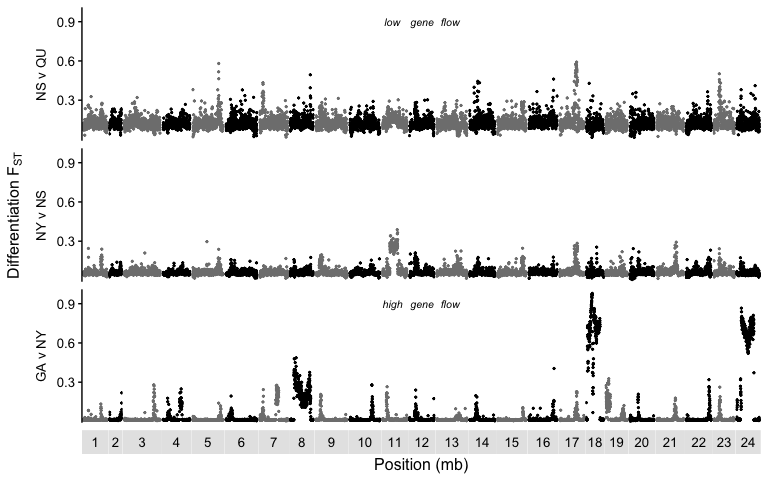<!-- -->

``` r
plotfst %>%
  filter(!is.na(fst)) %>% # Remove rows with NA in fst
  group_by(pop,regions) %>%
  summarise(
    mean_fst = mean(fst))
```

    ## # A tibble: 12 × 3
    ## # Groups:   pop [3]
    ##    pop     regions    mean_fst
    ##    <fct>   <fct>         <dbl>
    ##  1 NS v QU centromere   0.168 
    ##  2 NS v QU inversion    0.131 
    ##  3 NS v QU telomere     0.112 
    ##  4 NS v QU rest         0.127 
    ##  5 NY v NS centromere   0.102 
    ##  6 NY v NS inversion    0.0789
    ##  7 NY v NS telomere     0.0543
    ##  8 NY v NS rest         0.0597
    ##  9 GA v NY centromere   0.0602
    ## 10 GA v NY inversion    0.278 
    ## 11 GA v NY telomere     0.0173
    ## 12 GA v NY rest         0.0155

``` r
rest_NSQU <- plotfst %>% filter(regions=="rest" & pop=="NS v QU")
tel_NSQU <- plotfst %>% filter(regions=="telomere" & pop=="NS v QU")
t.test(rest_NSQU$fst,tel_NSQU$fst)
```

    ## 
    ##  Welch Two Sample t-test
    ## 
    ## data:  rest_NSQU$fst and tel_NSQU$fst
    ## t = 9.5562, df = 1089.1, p-value < 2.2e-16
    ## alternative hypothesis: true difference in means is not equal to 0
    ## 95 percent confidence interval:
    ##  0.01165284 0.01767450
    ## sample estimates:
    ## mean of x mean of y 
    ## 0.1266684 0.1120047

``` r
rest_NYNS <- plotfst %>% filter(regions=="rest" & pop=="NY v NS")
tel_NYNS <- plotfst %>% filter(regions=="telomere" & pop=="NY v NS")
t.test(rest_NYNS$fst,tel_NYNS$fst)
```

    ## 
    ##  Welch Two Sample t-test
    ## 
    ## data:  rest_NYNS$fst and tel_NYNS$fst
    ## t = 7.8498, df = 1120, p-value = 9.691e-15
    ## alternative hypothesis: true difference in means is not equal to 0
    ## 95 percent confidence interval:
    ##  0.004012324 0.006686532
    ## sample estimates:
    ##  mean of x  mean of y 
    ## 0.05966729 0.05431786

``` r
rest_GANY <- plotfst %>% filter(regions=="rest" & pop=="GA v NY")
tel_GANY <- plotfst %>% filter(regions=="telomere" & pop=="GA v NY")
t.test(rest_GANY$fst,tel_GANY$fst)
```

    ## 
    ##  Welch Two Sample t-test
    ## 
    ## data:  rest_GANY$fst and tel_GANY$fst
    ## t = -2.6781, df = 1302.2, p-value = 0.007498
    ## alternative hypothesis: true difference in means is not equal to 0
    ## 95 percent confidence interval:
    ##  -0.0030778797 -0.0004751591
    ## sample estimates:
    ##  mean of x  mean of y 
    ## 0.01551759 0.01729411

## Plot FST, recombination rate, centromeres, inversions, telomeres (Fig 3)

``` r
recomb_hyb <- read_delim("plot_files/input/recomb_df_015.txt", delim = " ") %>% 
  filter(set=="F1")  %>% group_by(map) %>% arrange(map,mb) %>%
  mutate(newDr=(regDr-min(regDr))/(max(regDr)-min(regDr))) %>% 
  rename("chr"="map")

telo_cen <- read_tsv("window50/alltelocentro.tsv")

inversions <- read_tsv(file = "plot_files/input/arne_inv_new.tsv") %>% 
  mutate(region="inversion") %>% 
  filter(!(chr==18 & start==8508524)) %>% 
  filter(!(chr==19 & start==3482194)) %>% 
  filter(!(chr==24 & start==12760364))

plotfstGANY <- plotfst %>% filter(pop=="GA v NY") %>% dplyr::rename("chr"="chromosome")

ggplot()+
  geom_point(data=recomb_hyb,aes(x=mb,y=newDr),color="gray")+
  geom_point(data=plotfstGANY,aes(x=midpoint/1e6, y=fst), color="black")+
  geom_rect(data=subset(telo_cen), aes(xmin=start_cV/1e6, xmax=end_cV/1e6, ymin=1, ymax=Inf), fill="dodgerblue2")+
    geom_rect(data=subset(telo_cen), aes(xmin=start_r/1e6, xmax=end_r/1e6, ymin=1, ymax=Inf), fill="red")+
    geom_rect(data=subset(telo_cen), aes(xmin=start_l/1e6, xmax=end_l/1e6, ymin=1, ymax=Inf), fill="red")+
    geom_rect(data=subset(inversions), aes(xmin=start/1e6, xmax=end/1e6, ymin=1, ymax=Inf), fill="goldenrod")+
  facet_wrap(~chr,scales="free",nrow=4)+
  scale_y_continuous(expand = c(0,0.2),breaks = c(0, 0.5, 1), name="GA vs. NY Differentiation (FST)",
                      sec.axis = sec_axis(trans=~.,name="Hybrid Recombination Rate (cM/Mb) Scaled to 1"),
                     labels = scales::number_format(accuracy = 0.1))+ 
  scale_x_continuous(labels = label_number(accuracy = 1))+
  theme_classic()+
  theme(panel.spacing = unit(1, "mm"),
        axis.ticks = element_line(linewidth=0.5),
        axis.ticks.length = unit(0.1, "cm"),
        axis.text.y.right = element_blank(),
        axis.ticks.y.right = element_blank(),
        axis.text=element_text(size=9,color="black"),
        strip.text = element_text(size = 11, margin = margin( b = 1, t = 1)))+
  xlab("Physical Position (mb)")
```

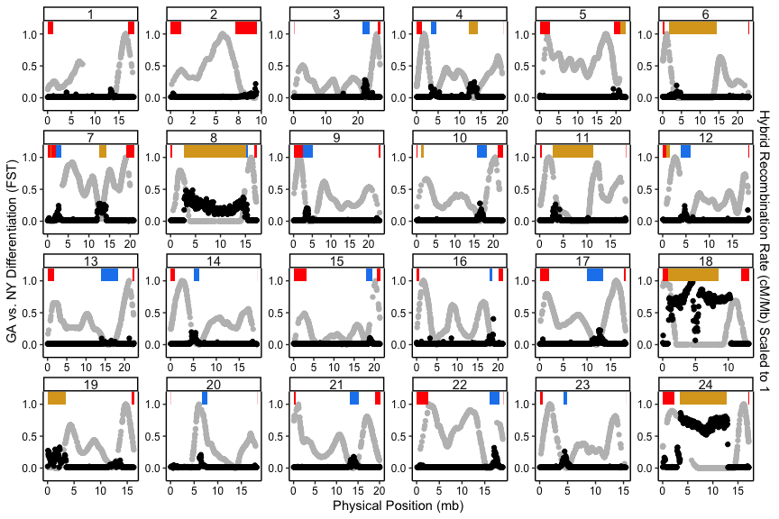<!-- -->

## FST and DXY by region (Fig 4)

``` r
plotdxy <- alldatareg %>% dplyr::select(chromosome,midpoint,regions,GANYdxy,NYNSdxy,NSQUdxy) %>% 
  pivot_longer(ends_with("dxy"), names_to="pop", values_to="dxy") %>% 
  mutate(pop=recode(pop, GANYdxy = "GA v NY", NYNSdxy= "NY v NS", NSQUdxy = "NS v QU")) %>%
  mutate(pop = factor(pop, levels=c('NS v QU','NY v NS','GA v NY'))) 


dxyfst <- plotfst %>% 
left_join(plotdxy, by=c("chromosome", "midpoint", "regions", "pop")) %>% 
  mutate(Inversion=case_when(regions=="inversion" & chromosome %in% c(8,11,18,24) ~ paste0("Inv_",chromosome), TRUE ~ "rest"))

f4a<-ggplot() + 
  geom_violin(data=subset(plotfst,regions %in% c("centromere","inversion")),
              aes(x=regions,y=fst,fill=regions),scale="width") + 
  geom_violin(data=subset(plotfst,regions %in% c("rest","telomere")),
              aes(x=regions,y=fst,fill=regions),scale="width") + 
  facet_grid(cols=vars(pop),scales="free")+
  scale_fill_manual(values=c("dodgerblue2","goldenrod2","gray30","red2"))+
  scale_color_manual(values=c("dodgerblue2","goldenrod2","gray30","red2"))+
  theme_classic()+
  theme(legend.position = "top", 
        legend.text = element_text(size=11),
        legend.key.size = unit(0.5,"line"),
        legend.title = element_blank(),
        strip.placement = "outside",
        axis.title.x = element_blank(),
        panel.border = element_rect(color="black",fill=NA,linewidth = 0.5),
        axis.ticks.y = element_line(linewidth = 0.5),
        panel.spacing.x = unit(4, "mm"),
        axis.line = element_blank(),
        axis.ticks.x = element_blank(),
        axis.title=element_text(size=14),
        axis.text.x = element_blank(),
        strip.background = element_blank(),
        strip.text = element_text(size=13),
        axis.text = element_text(color="black", size=10)) +
  ylab(expression(F["ST"]))


f4b<-ggplot() + 
  geom_violin(data=subset(plotdxy,regions %in% c("centromere","inversion")),
              aes(x=regions,y=dxy,fill=regions),scale="width") + 
  geom_violin(data=subset(plotdxy,regions %in% c("rest","telomere")),
              aes(x=regions,y=dxy,fill=regions),scale="width") + 
  facet_grid(cols=vars(pop),scales="free")+
  #facet_wrap(~stat+pop,nrow=1,scales = "free",strip.position = "bottom")+
  scale_fill_manual(values=c("dodgerblue2","goldenrod2","gray30","red2"))+
  scale_color_manual(values=c("dodgerblue2","goldenrod2","gray30","red2"))+
  theme_classic()+
  theme(legend.position = "none", 
        legend.text = element_text(size=11),
        legend.key.size = unit(0.5,"line"),
        legend.title = element_blank(),
        strip.placement = "outside",
        panel.spacing.x = unit(4, "mm"),
        axis.title.x = element_blank(),
        panel.border = element_rect(color="black",fill=NA,linewidth = 0.5),
        axis.ticks.y = element_line(linewidth = 0.5),
        axis.line = element_blank(),
        axis.ticks.x = element_blank(),
        axis.text.x = element_blank(),
        axis.title=element_text(size=14),
        strip.background = element_blank(),
        strip.text = element_text(size=13),
        axis.text = element_text(color="black", size=10)) +
  ylab(expression(d["XY"]))


f4c<-plotdxy %>% 
  filter(chromosome %in% c(8,11,18,24) & regions=="inversion") %>% 
  ggplot(aes(x=pop, y=dxy)) + 
  geom_violin(fill="goldenrod2",color="goldenrod2",alpha=0.7,scale="width")+
  theme_classic()+
  xlab("") +   ylab(expression(d["XY"]))+
    theme(legend.position = "bottom", 
        plot.margin=unit(c(0.1, 0.5, 0.1, 0.5), units="line"),
        legend.text = element_text(size=11),
        legend.key.size = unit(0.5,"line"),
        legend.title = element_blank(),
        strip.placement = "outside",
        axis.title.x = element_blank(),
        axis.title=element_text(size=13),
        panel.border = element_rect(color="black",fill=NA,linewidth = 0.5),
        axis.ticks.y = element_line(linewidth = 0.5),
        axis.line = element_blank(),
        axis.ticks.x = element_blank(),
        strip.background = element_blank(),
        strip.text = element_text(size=13),
        axis.text = element_text(color="black", size=10))+
  facet_wrap(factor(chromosome, labels =c('Inversion 8','Inversion 11','Inversion 18', "Inversion 24"))
~., nrow=1) + ylim(c(0,0.05))+    
  scale_x_discrete(labels = label_wrap(2))


f4d<-ggplot(dxyfst) +
  geom_point(aes(x=fst,y=dxy,color=regions,shape=Inversion),size=0.8)+
  facet_wrap(~pop)+
  scale_color_manual(values=c("dodgerblue2","goldenrod2","gray30","red2"),guide = 'none')+
  scale_shape_manual(values=c(5,0,3,6,20,1))+
  theme_classic()+
  theme(plot.margin=unit(c(0.1, 0.5, 0.1, 0.5), units="line"),
        legend.position = "top",
        legend.title=element_blank(),
        legend.text = element_text(size=11),
        legend.key.size = unit(0.5,"line"),
        strip.placement = "outside",
        legend.spacing.y = unit(1, 'mm'),
        legend.margin=margin(t = 0, b=0, unit='cm'),
        panel.border = element_rect(color="black",fill=NA,linewidth = 0.5),
        axis.ticks.y = element_line(linewidth = 0.5),
        panel.spacing.x = unit(4, "mm"),
        axis.line = element_blank(),
        axis.title=element_text(size=14),
        strip.background = element_blank(),
        strip.text = element_text(size=13),
        axis.text = element_text(color="black", size=10))+
  xlab(expression(F["ST"])) +   ylab(expression(d["XY"]))+
  scale_x_continuous(labels = label_number(accuracy = 0.1))+ 
  guides(shape = guide_legend(nrow = 1))

ggarrange(
  ggarrange(f4a, f4b, nrow = 2,labels = c("A","B"),common.legend = TRUE,legend = "top"),
  f4c,f4d,labels = c(" ","C","D"),
  nrow = 3,heights = c(1,0.55,0.7))
```

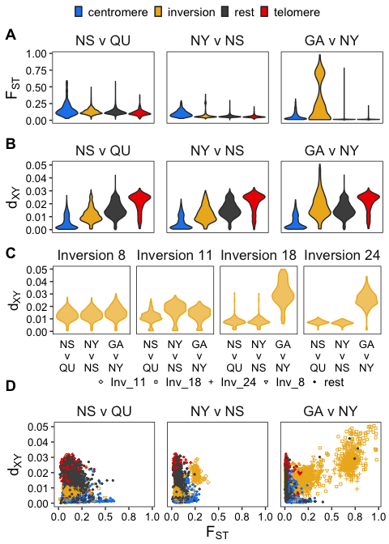<!-- -->

## Pi by region (Fig 5)

``` r
plotpi <- alldatareg %>% dplyr::select(chromosome,midpoint,regions,JIGA_pi2,PANY_pi2,MBNS_pi2,MAQU_pi2) %>%
  pivot_longer(ends_with("pi2"), names_to="pop", values_to="pi") %>% 
  mutate(pop=recode(pop, JIGA_pi2 = "JIGA", PANY_pi2 = "PANY", MBNS_pi2 = "MBNS", MAQU_pi2 = "MAQU")) %>% 
  mutate(pop = factor(pop, levels=c('MAQU','MBNS','PANY', "JIGA"))) 

f5a<-ggplot() + 
   geom_violin(data=subset(plotpi,regions %in% c("centromere","inversion")),
              aes(x=regions,y=pi,fill=regions),scale="width") + 
   geom_violin(data=subset(plotpi,regions %in% c("rest","telomere")),
              aes(x=regions,y=pi,fill=regions),scale="width") + 
  facet_grid(cols=vars(pop),scales="free")+
    scale_fill_manual(values=c("dodgerblue2","goldenrod2","gray30","red2"))+
  scale_color_manual(values=c("dodgerblue2","goldenrod2","gray30","red2"))+
  theme_classic()+
  theme(legend.position = "top", 
        plot.margin=unit(c(0.1, 0.5, 0.1, 0.75), units="line"),
        legend.text = element_text(size=11),
        legend.key.size = unit(0.5,"line"),
        legend.title = element_blank(),
        legend.margin=unit(0,"lines"),
        strip.placement = "outside",
        axis.title.x = element_blank(),
        axis.title=element_text(size=13),
        panel.border = element_rect(color="black",fill=NA,linewidth = 0.5),
        axis.ticks.y = element_line(linewidth = 0.5),
        axis.line = element_blank(),
        axis.ticks.x = element_blank(),
        axis.text.x = element_blank(),
        strip.background = element_blank(),
        strip.text = element_text(size=13),
        axis.text = element_text(color="black", size=10)) +
  ylab(expression(pi))


f5b<-plotpi %>% 
  filter(chromosome %in% c(8,11,18,24) & regions=="inversion") %>% 
  ggplot(aes(x=pop, y=pi)) + 
  geom_violin(fill="goldenrod2",color="goldenrod2",alpha=0.7,scale="width")+
  theme_classic()+
  xlab("") +  ylab(expression(pi))+
  theme(legend.position = "bottom", 
        plot.margin=unit(c(0.1, 0.5, 0.1, 0.75), units="line"),
        legend.text = element_text(size=11),
        legend.key.size = unit(0.5,"line"),
        legend.title = element_blank(),
        strip.placement = "outside",
        axis.title.x = element_blank(),
        axis.title=element_text(size=13),
        panel.border = element_rect(color="black",fill=NA,linewidth = 0.5),
        axis.ticks.y = element_line(linewidth = 0.5),
        axis.line = element_blank(),
        axis.ticks.x = element_blank(),
        strip.background = element_blank(),
        strip.text = element_text(size=13),
        axis.text = element_text(color="black", size=10)) +
  facet_wrap(factor(chromosome, labels =c('Inversion 8','Inversion 11','Inversion 18', "Inversion 24"))
~., nrow=1)
```

## Inv PCA

``` r
pca <- read_tsv("plot_files/input/combined_pca_results.txt") %>%
  mutate(region=paste0("chr",chr,"_",start)) %>%
  separate(population,into=c("pop","id"),sep="_") %>% rowid_to_column()


pca$pop<-factor(pca$pop,levels=c("JekyllIs","Patchogue","MinasBasin","MagdalenIs",
                                 labels=c("JIGA","PANY","MBNS","MAQU")))


mypca <- pca %>% mutate(inv=case_when(region=="chr07_648623" & PC1 < -0.3 ~ "SS",
                                      region=="chr12_816326" & PC1 < -0.4 ~ "SS",
                                      region=="chr10_1231858" & PC1 < -0.4 ~ "SS",
                                      region=="chr18_1607828" & id=="1070" ~ "NS",
                                      PC1 < -0.55 ~ "SS",
                                      PC1 > 0.25 ~ "NN",
                                      TRUE ~ "NS"))


plot_pca <- mypca %>% group_by(pop,chr,start,end,region,inv) %>%
  mutate(size=(end-start)/1e6) %>%
  mutate(size=round(size,digits=2)) %>% 
  mutate(pop=recode(pop, JekyllIs = "GA", Patchogue = "NY", MinasBasin = "NS", MagdalenIs = "QU")) %>%
  mutate(Inversion=paste0("chr",chr,"_",size)) %>% 
  mutate(Inversion = fct_reorder(Inversion, as.integer(chr,start))) %>% 
  rename("genotype"="inv","population"="pop")


ggplot(plot_pca)+
  geom_point(aes(x=PC1,y=PC2,color=population,shape=genotype))+
  facet_wrap(~Inversion,nrow=5)+
  scale_color_manual(values = c("#ed6677", "#67cced","#258942","#0073b2"))+
  theme_classic()+
  theme(
        strip.background = element_blank(),
        axis.line = element_blank(),
        strip.text = element_text(size=12),
        panel.border = element_rect(fill=NA,color="black"),
        axis.text = element_text(color="black"))
```

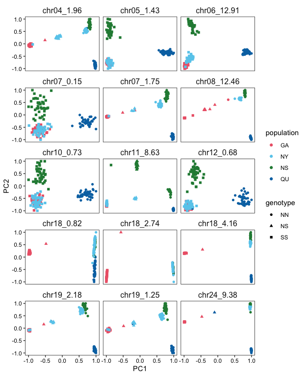<!-- -->

## Inversion Frequencies (Fig 5)

``` r
sizes_inv<-mypca %>% distinct(region,.keep_all=T) %>% mutate(size=end-start)


inv_freq<-mypca %>% group_by(chr,start,end,inv) %>% summarise(n=n(),prop=percent(n/168,accuracy=0.1)) %>% select(-n)


inv_freq_pop <- mypca %>% group_by(pop,chr,start,end,region,inv) %>%
  summarise(n=n(),prop=percent(n/42,accuracy=0.1),propp=(n/42)*100) %>% 
  select(-n) %>%
  mutate(size=(end-start)/1e6) %>%
  mutate(size=round(size,digits=2), propp=round(propp,digits=2)) %>% 
  mutate(pop=recode(pop, JekyllIs = "GA", Patchogue = "NY", MinasBasin = "NS", MagdalenIs = "QU")) %>%
  mutate(Inversion=paste0("chr",chr,"_",size)) %>% 
  mutate(Inversion = fct_reorder(Inversion, as.integer(chr,start))) 


inv_freq_pop_cut<-inv_freq_pop  %>% ungroup() %>% 
  select(pop,Inversion,propp,inv) %>%
  pivot_wider(names_from=c("pop","inv"),values_from="propp") %>% 
  filter(!(Inversion %in% c("chr18_2.74","chr18_4.16"))) %>% 
  mutate(Inversion=recode(Inversion, chr18_0.82 = "chr18_7.72"))

inv_freq_pop_cut[is.na(inv_freq_pop_cut)] = 0

inv_freq_pop_zero <- inv_freq_pop_cut %>% 
  pivot_longer(GA_NS:QU_NS, names_to="label",values_to="propp") %>% 
  separate(label,into=c("pop","inv"),sep="_") %>% 
  mutate(prop=percent(propp/100,accuracy=0.1))


inv_freq_pop_zero$pop<-factor(inv_freq_pop_zero$pop,levels=c("QU","NS","NY","GA"))


f5c<-ggplot(inv_freq_pop_zero,aes(x=inv,y=Inversion))+
  geom_tile(aes(fill=propp),color="black")+
  geom_text(aes(label = prop),size=2.8)+
  facet_wrap(~pop,nrow = 1)+
  scale_fill_gradientn(colors = c("white", "#ffcdc4", "#f7a697", "#e0644f", "#c7503c"),
  values = scales::rescale(c(0, 5, 50, 90, 100)),
  limits = c(0, 100)) +
  theme_classic()+
  theme(legend.title=element_blank(),
        strip.placement="outside",
        legend.key.size = unit(1,"line"),
        legend.key.height = unit(0.5,"line"),
        axis.title.y = element_blank(),
        axis.title.x = element_text(vjust = 0),
        legend.spacing.y = unit(1, 'mm'),
        legend.justification = "bottom",
        strip.background = element_blank(),
        strip.text = element_text(size=13),
        legend.margin=margin(t = 0.1, b=0, unit='cm'),
        legend.position="bottom",
        legend.box.spacing = margin(0),
        axis.text=element_text(color="black"))+
  xlab("Genotype")+
  scale_y_discrete(limits=rev)+
  scale_x_discrete(position = "top") 


ggarrange(f5a,f5b,f5c,labels=c("A","B","C"),nrow=3,heights=c(0.45,0.4,1))
```

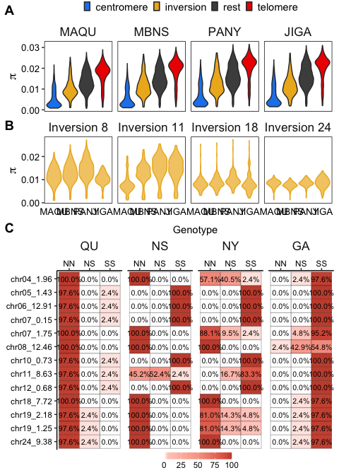<!-- -->

## FST and recombination rate correlation (Fig S2)

``` r
rrF1fst<-ggplot(alldatareg,aes(x=avgrrF1,y=fstGANY,color=regions)) + 
  geom_point(alpha=0.5)+
  geom_smooth(method="lm",se=F)+
  #stat_cor(cor.coef.name = "tau",method = "kendall",p.accuracy = 0.001, r.accuracy = 0.01,label.x=15,size=3)+
  scale_color_manual(values=c("dodgerblue2","goldenrod2","gray30","red2"))+
  ylab(expression(paste(F["ST"]~" GA v NY"))) +
  xlab("GA-NY Hybrid Recomb. Rate")+
  theme_classic()+
  theme(legend.position = "top",
        axis.title=element_text(size=11),
        axis.line = element_blank(),
        panel.border = element_rect(color="black",fill=NA,linewidth = 0.5),
        axis.ticks.y = element_line(linewidth = 0.5),
        legend.title = element_blank(),
        legend.box.margin=margin(-5,-5,-5,-5),
        strip.background = element_blank(),
        strip.text=element_text(size=11),
        axis.text = element_text(color="black",size=10))

cor.test(alldatareg$avgrrF1,alldatareg$fstGANY,method="kendall")
```

    ## 
    ##  Kendall's rank correlation tau
    ## 
    ## data:  alldatareg$avgrrF1 and alldatareg$fstGANY
    ## z = -24.233, p-value < 2.2e-16
    ## alternative hypothesis: true tau is not equal to 0
    ## sample estimates:
    ##        tau 
    ## -0.2090997

``` r
rrGAfst<-ggplot(alldatareg,aes(x=avgrr,y=fstGANY,color=regions)) + 
   geom_point(alpha=0.5)+
  geom_smooth(method="lm",se=F)+
  #stat_cor(cor.coef.name = "tau",method = "kendall",p.accuracy = 0.001, r.accuracy = 0.01,label.x=15,size=3)+
  scale_color_manual(values=c("dodgerblue2","goldenrod2","gray30","red2"))+
  ylab(expression(paste(F["ST"]~" GA v NY"))) +
  xlab("GA Recomb. Rate (cm/mb)")+
  theme_classic()+
  theme(legend.position = "top",
        axis.title=element_text(size=11),
        axis.line = element_blank(),
        panel.border = element_rect(color="black",fill=NA,linewidth = 0.5),
        axis.ticks.y = element_line(linewidth = 0.5),
        legend.title = element_blank(),
        legend.box.margin=margin(-5,-5,-5,-5),
        strip.background = element_blank(),
        strip.text=element_text(size=11),
        axis.text = element_text(color="black",size=10))


rrNYfst<-ggplot(alldatareg,aes(x=avgrrNY,y=fstGANY,color=regions)) + 
  geom_point(alpha=0.5)+
  geom_smooth(method="lm",se=F)+
  #stat_cor(cor.coef.name = "tau",method = "kendall",p.accuracy = 0.001, r.accuracy = 0.01,label.x=15,size=3)+
  scale_color_manual(values=c("dodgerblue2","goldenrod2","gray30","red2"))+
  ylab(expression(paste(F["ST"]~" GA v NY"))) +
  xlab("NY Recomb. Rate (cm/mb)")+
  theme_classic()+
  theme(legend.position = "top",
        axis.title=element_text(size=11),
        axis.line = element_blank(),
        panel.border = element_rect(color="black",fill=NA,linewidth = 0.5),
        axis.ticks.y = element_line(linewidth = 0.5),
        legend.title = element_blank(),
        legend.box.margin=margin(-5,-5,-5,-5),
        strip.background = element_blank(),
        strip.text=element_text(size=11),
        axis.text = element_text(color="black",size=10))


ggarrange(rrGAfst,rrF1fst,rrNYfst,nrow=1,ncol=3,
          common.legend = TRUE,legend = "top")
```

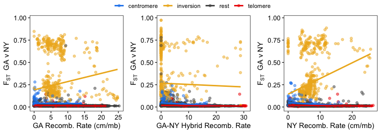<!-- -->

## Centromeres vs telomeres mean FST, centromeres vs inversions PCA (Fig S3)

``` r
testfst <- plotfst %>% 
  filter(regions %in% c("centromere","telomere")) %>% 
  group_by(pop,chromosome,regions) %>% 
  summarise(avgfst=mean(fst,na.rm = T),
            sd=sd(fst,na.rm = T),
            n = n(),
            se = sd / sqrt(n))


avgfstp<-ggplot(testfst,aes(x=chromosome,y=avgfst,color=pop))+
  geom_point()+
  geom_errorbar(aes(ymin=avgfst-se, ymax=avgfst+se), width=.2) +
  facet_wrap(~regions,switch = "y",nrow=2,scales="free_x")+
  scale_color_manual(values=c("navyblue","orange3","red4"))+
  theme_classic()+
  theme(legend.position = "top",
        strip.placement = "outside",
        strip.text.y = element_text(margin = margin(0,0,0,0, "cm"),size=10),
        axis.title=element_text(size=11),
        legend.box.margin=margin(-5,-5,-5,-5),
        legend.title = element_blank(),
        strip.background = element_blank(),
        axis.text = element_text(color="black",size=10))+
    scale_x_continuous(limits=c(1,24),breaks=seq(1,24,1),expand = c(0.03, 0.03))  + ylab(expression(paste("Average"~F["ST"])))+xlab("Chromosome")


chr13<-read_table("plot_files/input/chom13centropca.txt")
chr17<-read_table("plot_files/input/chom17centropca.txt")
chr11<-read_table("plot_files/input/chom11invpca.txt")
chr24<-read_table("plot_files/input/chom24invpca.txt")

pca<-bind_rows("13"=chr13,"17"=chr17,"11"=chr11,"24"=chr24,.id="chromosome")%>% 
  mutate(population=recode(population, JekyllIs = "GA", Patchogue = "NY", MinasBasin = "NS", MagdalenIs = "QU"))%>% 
  mutate(population = factor(population, levels=c('GA','NY','NS','QU'))) %>% 
  mutate(chromosome = factor(chromosome, levels=c('13','17','11','24'))) 

pcap<-ggplot(pca,aes(x=PC1,y=PC2,color=population))+
  geom_point()+
  facet_wrap(factor(chromosome, labels =c('Centromere Chr.13','Centromere Chr.17','Inversion Chr.11', "Inversion Chr.24"))~., nrow=1)+
  theme_classic()+
  scale_color_manual(values = c("#ed6677", "#67cced","#258942","#0073b2"))+
  theme(legend.position = "top",
        axis.title=element_text(size=11),
        axis.line = element_blank(),
        panel.border = element_rect(color="black",fill=NA,linewidth = 0.5),
        axis.ticks.y = element_line(linewidth = 0.5),
        legend.title = element_blank(),
        legend.box.margin=margin(-5,-5,-5,-5),
        strip.background = element_blank(),
        strip.text=element_text(size=11),
        axis.text = element_text(color="black",size=10))

ggarrange(avgfstp,pcap,labels=c("A","B"),nrow=2,heights = c(1,1))
```

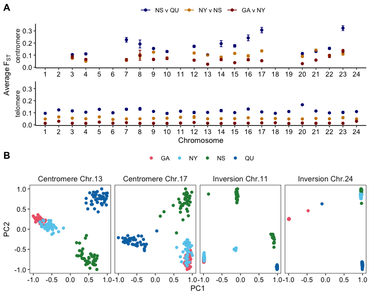<!-- -->

## Plot sequence divergence, dxy (Fig S4)

``` r
ggplot(plotdxy) +
  geom_point(aes(x=midpoint/1e6, y=dxy, color=as.factor(chromosome)), alpha=1, size=0.3, shape = 20) +
  scale_color_manual(values=rep(c("gray50","black"),100))+
  scale_y_continuous(expand = c(0, 0.01), limits=c(0,0.06), breaks = c(0, 0.03, 0.06)) +
  xlab("Position (Mbp)") +
  facet_grid(cols = vars(chromosome),rows = vars(pop),
             space = "free_x",switch = "both",
             scales = "free_x") +     
  ylab(expression(paste("Sequence Divergence"~d["XY"]))) +
  theme(
    panel.grid.minor=element_blank(),
    panel.grid.major=element_blank(),
    panel.background=element_blank(),
    axis.text = element_text(colour = "black", size = 10),
    axis.line.y = element_line(colour = "black", linewidth = 0.5),
    axis.line.x = element_blank(),
    axis.ticks.x = element_blank(),
    axis.ticks.y = element_line(colour = "black", linewidth = 0.5),
    axis.ticks.length = unit(0.2, "cm"),
    strip.placement = "outside",
    axis.title = element_text(colour = "black", size = 12),
    legend.position="none", 
    strip.text = element_text(colour = "black", size = 10),
    panel.spacing.x = unit(0, "mm"),
    panel.spacing.y = unit(2, "mm"),
    strip.background.x=element_rect(fill="gray90"),
    strip.background.y = element_blank(),
    axis.text.x = element_blank())
```

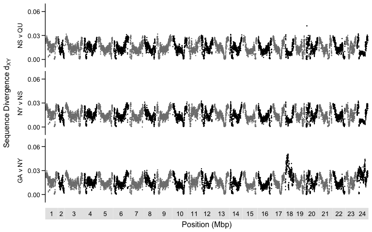<!-- -->

## Plot nucleotide diversity, pi (Fig S5)

``` r
ggplot(plotpi) +
  geom_point(aes(x=midpoint/1e6, y=pi, color=as.factor(chromosome)), alpha=1, size=0.3, shape = 20) +
  scale_color_manual(values=rep(c("gray50","black"),100))+
  scale_y_continuous(expand = c(0, 0.01), limits=c(0,0.04), breaks = c(0, 0.02, 0.04)) +
  xlab("Position (Mbp)") +
  facet_grid(cols = vars(chromosome),rows = vars(pop),
             space = "free_x",switch = "both",
             scales = "free_x") +     
  ylab(expression(paste("Nucleotide diversity"~(pi))))+
  theme(
    panel.grid.minor=element_blank(),
    panel.grid.major=element_blank(),
    panel.background=element_blank(),
    axis.text = element_text(colour = "black", size = 10),
    axis.line.y = element_line(colour = "black", linewidth = 0.5),
    axis.line.x = element_blank(),
    axis.ticks.x = element_blank(),
    axis.ticks.y = element_line(colour = "black", linewidth = 0.5),
    axis.ticks.length = unit(0.2, "cm"),
    strip.placement = "outside",
    axis.title = element_text(colour = "black", size = 12),
    legend.position="none", 
    strip.text = element_text(colour = "black", size = 10),
    panel.spacing.x = unit(0, "mm"),
    panel.spacing.y = unit(2, "mm"),
    strip.background.x=element_rect(fill="gray90"),
    strip.background.y = element_blank(),
    axis.text.x = element_blank())
```

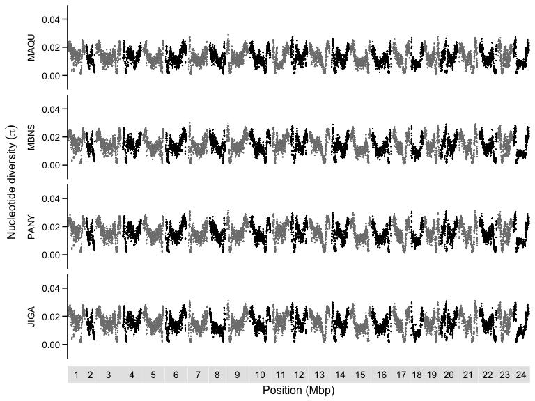<!-- -->

## Diversity and differentiation correlation plots (Fig S6)

``` r
gap<-ggplot(alldatareg,aes(x=JIGA_pi2,y=fstGANY,color=regions)) + 
  geom_point(size=0.5)+
  scale_color_manual(values=c("dodgerblue2","goldenrod2","gray30","red2"))+
  ylab(expression(paste(F["ST"]~" GA v NY"))) +
  xlab(expression(paste("GA"~pi)))+
  theme_classic()+
  theme(legend.position = "top",
        axis.title=element_text(size=13),
        axis.line = element_blank(),
        panel.border = element_rect(color="black",fill=NA,linewidth = 0.5),
        axis.ticks.y = element_line(linewidth = 0.5),
        legend.title = element_blank(),
        legend.box.margin=margin(-5,-5,-5,-5),
        strip.background = element_blank(),
        strip.text=element_text(size=11),
        axis.text = element_text(color="black",size=8),        
        legend.text = element_text(size=13))+ 
  guides(color = guide_legend(override.aes = list(size = 4)))

nyp<-ggplot(alldatareg,aes(x=PANY_pi2,y=fstGANY,color=regions)) + 
  geom_point(size=0.5)+
  scale_color_manual(values=c("dodgerblue2","goldenrod2","gray30","red2"))+
  ylab(expression(paste(F["ST"]~" GA v NY"))) +
  xlab(expression(paste("NY"~pi)))+
  theme_classic()+
  theme(legend.position = "top",
        axis.title=element_text(size=13),
        axis.line = element_blank(),
        panel.border = element_rect(color="black",fill=NA,linewidth = 0.5),
        axis.ticks.y = element_line(linewidth = 0.5),
        legend.title = element_blank(),
        legend.box.margin=margin(-5,-5,-5,-5),
        strip.background = element_blank(),
        strip.text=element_text(size=11),
        axis.text = element_text(color="black",size=8),        
        legend.text = element_text(size=13))+ 
  guides(color = guide_legend(override.aes = list(size = 4)))

nyp2<-ggplot(alldatareg,aes(x=PANY_pi2,y=fstNYNS,color=regions)) + 
  geom_point(size=0.5)+
  scale_color_manual(values=c("dodgerblue2","goldenrod2","gray30","red2"))+
  ylab(expression(paste(F["ST"]~" NY v NS"))) +
  xlab(expression(paste("NY"~pi)))+
  theme_classic()+
  theme(legend.position = "top",
        axis.title=element_text(size=13),
        axis.line = element_blank(),
        panel.border = element_rect(color="black",fill=NA,linewidth = 0.5),
        axis.ticks.y = element_line(linewidth = 0.5),
        legend.title = element_blank(),
        legend.box.margin=margin(-5,-5,-5,-5),
        strip.background = element_blank(),
        strip.text=element_text(size=11),
        axis.text = element_text(color="black",size=8),        
        legend.text = element_text(size=13))+ 
  guides(color = guide_legend(override.aes = list(size = 4)))


nsp<-ggplot(alldatareg,aes(x=MBNS_pi2,y=fstNYNS,color=regions)) + 
  geom_point(size=0.5)+
  scale_color_manual(values=c("dodgerblue2","goldenrod2","gray30","red2"))+
  ylab(expression(paste(F["ST"]~" NY v NS"))) +
  xlab(expression(paste("NS"~pi)))+
  theme_classic()+
  theme(legend.position = "top",
        axis.title=element_text(size=13),
        axis.line = element_blank(),
        panel.border = element_rect(color="black",fill=NA,linewidth = 0.5),
        axis.ticks.y = element_line(linewidth = 0.5),
        legend.title = element_blank(),
        legend.box.margin=margin(-5,-5,-5,-5),
        strip.background = element_blank(),
        strip.text=element_text(size=11),
        axis.text = element_text(color="black",size=8),        
        legend.text = element_text(size=13))+ 
  guides(color = guide_legend(override.aes = list(size = 4)))


nsp2<-ggplot(alldatareg,aes(x=MBNS_pi2,y=fstNSQU,color=regions)) + 
  geom_point(size=0.5)+
  scale_color_manual(values=c("dodgerblue2","goldenrod2","gray30","red2"))+
  ylab(expression(paste(F["ST"]~" NS v QU"))) +
  xlab(expression(paste("NS"~pi)))+
  theme_classic()+
  theme(legend.position = "top",
        axis.title=element_text(size=13),
        axis.line = element_blank(),
        panel.border = element_rect(color="black",fill=NA,linewidth = 0.5),
        axis.ticks.y = element_line(linewidth = 0.5),
        legend.title = element_blank(),
        legend.box.margin=margin(-5,-5,-5,-5),
        strip.background = element_blank(),
        strip.text=element_text(size=11),
        axis.text = element_text(color="black",size=8),        
        legend.text = element_text(size=13))+ 
  guides(color = guide_legend(override.aes = list(size = 4)))


qup<-ggplot(alldatareg,aes(x=MAQU_pi2,y=fstNSQU,color=regions)) + 
  geom_point(size=0.5)+
  scale_color_manual(values=c("dodgerblue2","goldenrod2","gray30","red2"))+
  ylab(expression(paste(F["ST"]~" NS v QU"))) +
  xlab(expression(paste("QU"~pi)))+
  theme_classic()+
  theme(legend.position = "top",
        axis.title=element_text(size=13),
        axis.line = element_blank(),
        panel.border = element_rect(color="black",fill=NA,linewidth = 0.5),
        axis.ticks.y = element_line(linewidth = 0.5),
        legend.title = element_blank(),
        legend.box.margin=margin(-5,-5,-5,-5),
        strip.background = element_blank(),
        strip.text=element_text(size=11),
        axis.text = element_text(color="black",size=8),        
        legend.text = element_text(size=13))+ 
  guides(color = guide_legend(override.aes = list(size = 4)))


dgap<-ggplot(alldatareg,aes(x=JIGA_pi2,y=GANYdxy,color=regions)) + 
  geom_point(size=0.5)+
  scale_color_manual(values=c("dodgerblue2","goldenrod2","gray30","red2"))+
  ylab(expression(paste(d["XY"]~" GA v NY"))) +
  xlab(expression(paste("GA"~pi)))+
  theme_classic()+
  theme(legend.position = "top",
        axis.title=element_text(size=13),
        axis.line = element_blank(),
        panel.border = element_rect(color="black",fill=NA,linewidth = 0.5),
        axis.ticks.y = element_line(linewidth = 0.5),
        legend.title = element_blank(),
        legend.box.margin=margin(-5,-5,-5,-5),
        strip.background = element_blank(),
        strip.text=element_text(size=11),
        axis.text = element_text(color="black",size=8),        
        legend.text = element_text(size=13))+ 
  guides(color = guide_legend(override.aes = list(size = 4)))

dnyp<-ggplot(alldatareg,aes(x=PANY_pi2,y=GANYdxy,color=regions)) + 
  geom_point(size=0.5)+
  scale_color_manual(values=c("dodgerblue2","goldenrod2","gray30","red2"))+
  ylab(expression(paste(d["XY"]~" GA v NY"))) +
  xlab(expression(paste("NY"~pi)))+
  theme_classic()+
  theme(legend.position = "top",
        axis.title=element_text(size=13),
        axis.line = element_blank(),
        panel.border = element_rect(color="black",fill=NA,linewidth = 0.5),
        axis.ticks.y = element_line(linewidth = 0.5),
        legend.title = element_blank(),
        legend.box.margin=margin(-5,-5,-5,-5),
        strip.background = element_blank(),
        strip.text=element_text(size=11),
        axis.text = element_text(color="black",size=8),        
        legend.text = element_text(size=13))+ 
  guides(color = guide_legend(override.aes = list(size = 4)))

dnyp2<-ggplot(alldatareg,aes(x=PANY_pi2,y=NYNSdxy,color=regions)) + 
  geom_point(size=0.5)+
  scale_color_manual(values=c("dodgerblue2","goldenrod2","gray30","red2"))+
  ylab(expression(paste(d["XY"]~" NY v NS"))) +
  xlab(expression(paste("NY"~pi)))+
  theme_classic()+
  theme(legend.position = "top",
        axis.title=element_text(size=13),
        axis.line = element_blank(),
        panel.border = element_rect(color="black",fill=NA,linewidth = 0.5),
        axis.ticks.y = element_line(linewidth = 0.5),
        legend.title = element_blank(),
        legend.box.margin=margin(-5,-5,-5,-5),
        strip.background = element_blank(),
        strip.text=element_text(size=11),
        axis.text = element_text(color="black",size=8),        
        legend.text = element_text(size=13))+ 
  guides(color = guide_legend(override.aes = list(size = 4)))


dnsp<-ggplot(alldatareg,aes(x=MBNS_pi2,y=NYNSdxy,color=regions)) + 
  geom_point(size=0.5)+
  scale_color_manual(values=c("dodgerblue2","goldenrod2","gray30","red2"))+
  ylab(expression(paste(d["XY"]~" NY v NS"))) +
  xlab(expression(paste("NS"~pi)))+
  theme_classic()+
  theme(legend.position = "top",
        axis.title=element_text(size=13),
        axis.line = element_blank(),
        panel.border = element_rect(color="black",fill=NA,linewidth = 0.5),
        axis.ticks.y = element_line(linewidth = 0.5),
        legend.title = element_blank(),
        legend.box.margin=margin(-5,-5,-5,-5),
        strip.background = element_blank(),
        strip.text=element_text(size=11),
        axis.text = element_text(color="black",size=8),        
        legend.text = element_text(size=13))+ 
  guides(color = guide_legend(override.aes = list(size = 4)))


dnsp2<-ggplot(alldatareg,aes(x=MBNS_pi2,y=NSQUdxy,color=regions)) + 
  geom_point(size=0.5)+
  scale_color_manual(values=c("dodgerblue2","goldenrod2","gray30","red2"))+
  ylab(expression(paste(d["XY"]~" NS v QU"))) +
  xlab(expression(paste("NS"~pi)))+
  theme_classic()+
  theme(legend.position = "top",
        axis.title=element_text(size=13),
        axis.line = element_blank(),
        panel.border = element_rect(color="black",fill=NA,linewidth = 0.5),
        axis.ticks.y = element_line(linewidth = 0.5),
        legend.title = element_blank(),
        legend.box.margin=margin(-5,-5,-5,-5),
        strip.background = element_blank(),
        strip.text=element_text(size=11),
        axis.text = element_text(color="black",size=8),        
        legend.text = element_text(size=13))+ 
  guides(color = guide_legend(override.aes = list(size = 4)))


dqup<-ggplot(alldatareg,aes(x=MAQU_pi2,y=NSQUdxy,color=regions)) + 
  geom_point(size=0.5)+
  scale_color_manual(values=c("dodgerblue2","goldenrod2","gray30","red2"))+
  ylab(expression(paste(d["XY"]~" NS v QU"))) +
  xlab(expression(paste("QU"~pi)))+
  theme_classic()+
  theme(legend.position = "top",
        axis.title=element_text(size=13),
        plot.margin = margin(0,0.5,0,0, "lines"),
        axis.line = element_blank(),
        panel.border = element_rect(color="black",fill=NA,linewidth = 0.5),
        axis.ticks.y = element_line(linewidth = 0.5),
        legend.title = element_blank(),
        legend.box.margin=margin(-5,-5,-5,-5),
        strip.background = element_blank(),
        strip.text=element_text(size=11),
        axis.text = element_text(color="black",size=8),        
        legend.text = element_text(size=13))+ 
  guides(color = guide_legend(override.aes = list(size = 4)))


ggarrange(gap, nyp, nyp2, nsp, nsp2, qup,
          dgap, dnyp, dnyp2, dnsp, dnsp2, dqup,ncol = 3,nrow=4,
          common.legend = TRUE,legend = "top",vjust = 0.5,
          font.label = list(size=16),labels=c("A","","","","","","B"))
```

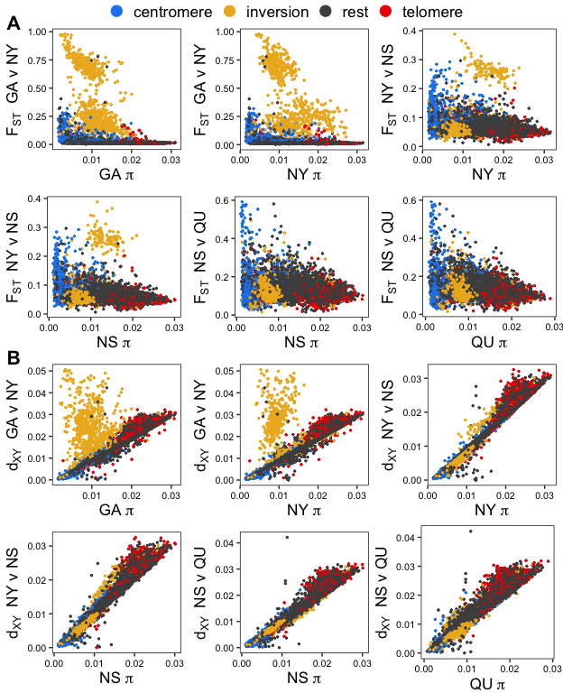<!-- -->

## Plot Tajima’s D (Fig S7)

``` r
alltajD <- alldatareg %>% dplyr::select(chromosome,midpoint,regions,tajJIGA,tajPANY,tajMBNS,tajMAQU) %>% 
  pivot_longer(starts_with("taj"), names_to="pop", values_to="taj") %>% 
  mutate(pop=recode(pop, tajJIGA = "GA", tajPANY = "NY", tajMBNS = "NS", tajMAQU = "QU")) %>% 
  mutate(pop = factor(pop, levels=c('QU','NS','NY','GA'))) 

ggplot(alltajD) +
  geom_point(aes(x=midpoint/1e6, y=taj, color=as.factor(chromosome)), alpha=1, size=0.3, shape = 20) +
  scale_color_manual(values=rep(c("gray50","black"),100))+
  scale_y_continuous(expand = c(0, 0.01), limits=c(-3,2), breaks = c(-2,-1,0,1,2)) +
  xlab("Position (Mbp)") +
  facet_grid(cols = vars(chromosome),rows = vars(pop),
             space = "free_x",switch = "both",
             scales = "free_x") +     
  ylab("Tajima's D")+
  theme(
    panel.grid.minor=element_blank(),
    panel.grid.major=element_blank(),
    panel.background=element_blank(),
    axis.text = element_text(colour = "black", size = 10),
    axis.line.y = element_line(colour = "black", linewidth = 0.5),
    axis.line.x = element_blank(),
    axis.ticks.x = element_blank(),
    axis.ticks.y = element_line(colour = "black", linewidth = 0.5),
    axis.ticks.length = unit(0.2, "cm"),
    strip.placement = "outside",
    axis.title = element_text(colour = "black", size = 12),
    legend.position="none", 
    strip.text = element_text(colour = "black", size = 10),
    panel.spacing.x = unit(0, "mm"),
    panel.spacing.y = unit(2, "mm"),
    strip.background.x=element_rect(fill="gray90"),
    strip.background.y = element_blank(),
    axis.text.x = element_blank())
```

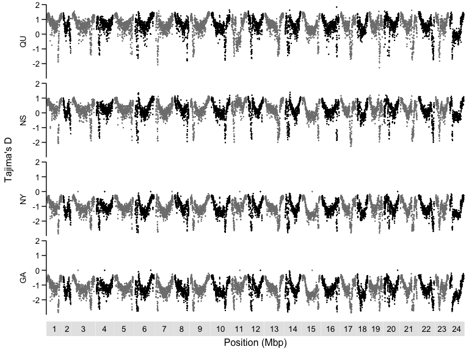<!-- -->

## Recomb rate vs. genome features (Fig S8)

``` r
reps<-read_tsv("window50/repwindows.txt") %>% full_join(alldatareg,by=c("chr"="chromosome","col1","col2"))

gaco<- reps %>% select(avgrr,fstGANY,JIGA_pi2,GANYdxy,gc,exond,reps)

testcor<-cor(gaco, use = "complete.obs",method = "kendall")

gacor <- reps %>% 
  select(avgrr, regions, JIGA_pi2, GANYdxy, gc, exond, reps) %>% 
  pivot_longer(JIGA_pi2:reps, names_to = "stat", values_to = "value") %>% 
  drop_na() %>% 
  mutate(stat = factor(stat, 
                       levels = c('gc', 'exond', 'reps','JIGA_pi2', 'GANYdxy')))

# Create custom labels as a named vector using expression
custom_labels <- c(
  gc = "GC~Content",
  exond = "Exon~Density",
  reps = "Repeat~Content",
  JIGA_pi2 = "Diversity~(pi)",
  GANYdxy = "Divergence~(d[XY])"
)

ggplot(data = gacor, aes(x = avgrr, y = value)) +
  geom_point(color = "gray70",size=0.8) +
  geom_smooth(method = "lm", se = FALSE) +
  #stat_cor(aes(label = ..r.label..),method = "kendall",r.accuracy = 0.01,label.x=18,label.y.npc = "top", cor.coef.name = "tau",size=3,color="blue")+
  facet_wrap(~stat, scales = "free", nrow = 2, 
             labeller = labeller(stat = as_labeller(custom_labels, label_parsed))) +
  theme_classic() +
  theme(axis.text = element_text(color = "black"),
        axis.title=element_text(size=11),
        strip.text=element_text(size=11),
        axis.line = element_blank(),
        axis.ticks = element_line(linewidth = 0.5),
        panel.border = element_rect(color = "black", fill = NA, linewidth = 0.5),
        strip.background = element_blank()) +
  labs(x = "Average Recombination Rate (cm/mb)", y = "")
```

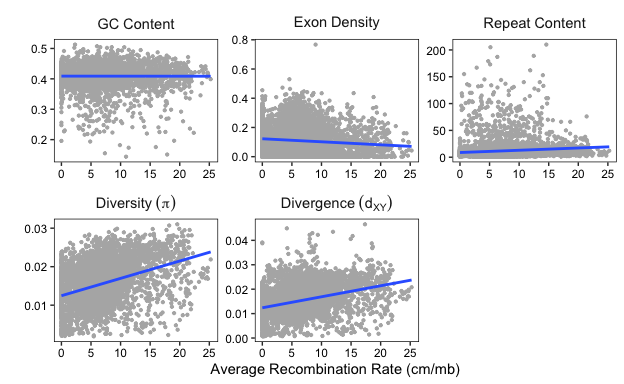<!-- -->

``` r
rpi <- cor.test(gaco$avgrr,gaco$JIGA_pi2, method="kendall")
rfst <-cor.test(gaco$avgrr,gaco$fstGANY, method="kendall")
rgc <- cor.test(gaco$avgrr,gaco$gc, method="kendall")
rex <- cor.test(gaco$avgrr,gaco$exond, method="kendall")
rdx <- cor.test(gaco$avgrr,gaco$GANYdxy, method="kendall")
rep <- cor.test(gaco$avgrr,gaco$reps, method="kendall")


results <- data.frame(
  stat_pop = character(),
  tau = numeric(),
  p_value = numeric(),
  stringsAsFactors = FALSE
)

# List of your output lists
output_lists <- list(rpi,rfst,rdx,rgc,rex,rep)

# Names corresponding to each list
list_names <- c("pi","fst","dxy","gc","exon","repeats")

# Loop through each list and extract the tau and p-value
for(i in seq_along(output_lists)) {
  list_item <- output_lists[[i]]
  
  # Extract tau estimate and p-value
  tau_estimate <- list_item$estimate
  p_value <- list_item$p.value
  
  # Add the results to the results data frame
  results <- rbind(results, data.frame(
    stat_pop = list_names[i],
    tau = tau_estimate,
    p_value = p_value,
    stringsAsFactors = FALSE
  ))
}

# Round the tau and p_value columns to three digits
results$tau <- round(results$tau, 2)
results$p_value <- round(results$p_value, 3)

# View the rounded results
print(results)
```

    ##      stat_pop   tau p_value
    ## tau        pi  0.25       0
    ## tau1      fst -0.10       0
    ## tau2      dxy  0.24       0
    ## tau3       gc  0.04       0
    ## tau4     exon -0.05       0
    ## tau5  repeats  0.14       0

## SNP depth across genome (Fig S9)

``` r
ga.dep <- read_tsv("plot_files/input/JIGAdepavg.tsv")
ny.dep <- read_tsv("plot_files/input/PANYdepavg.tsv")
ns.dep <- read_tsv("plot_files/input/MBNSdepavg.tsv")
qu.dep <- read_tsv("plot_files/input/MAQUdepavg.tsv")

depths <- bind_rows("GA"=ga.dep,"NY"=ny.dep,"NS"=ns.dep,"QU"=qu.dep,.id="pop") %>% full_join(alldatareg,by=c("chromo"="chromosome","col1","col2")) %>% drop_na() %>% select(pop,chromo,midpoint,regions,avg_dep,n_snps)


ggplot(depths) +
  geom_point(aes(x=midpoint/1e6, y=n_snps, color=regions), alpha=1, size=1, shape = 20) +
  scale_color_manual(values=c("dodgerblue2","goldenrod2","gray30","red2"))+
  facet_grid(cols = vars(chromo),rows = vars(pop),
             space = "free_x",
             scales = "free_x",
             switch = "y") +
  theme(
    panel.grid.minor=element_blank(),
    panel.grid.major=element_blank(),
    panel.background=element_blank(),
    axis.text = element_text(colour = "black", size = 10),
    panel.spacing.x = unit(0.05, "cm"),
    panel.spacing.y = unit(0.3, "cm"),
    axis.text.x = element_blank(),
    axis.ticks.x = element_blank(),
    strip.text=element_text(size=10),
    strip.background.y = element_blank(),
    axis.line.y = element_line(linewidth = 0.5),
    axis.title.x = element_blank(),
    strip.placement = "outside",
    legend.position = "top",
    legend.key = element_rect(fill = NA, color = NA),
    legend.title=element_blank())+ 
  guides(color = guide_legend(override.aes = list(size = 4)))+
  ylab("Number of SNPs")
```

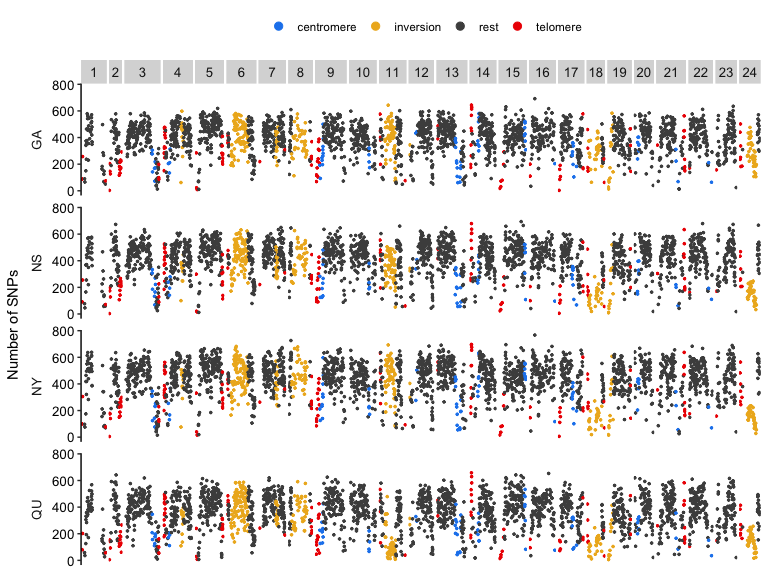<!-- -->

``` r
depths %>% group_by(regions,pop) %>% 
  summarise(total_SNPs=sum(n_snps),mean_SNPs=mean(n_snps),
            min_SNPs=min(n_snps),max_SNPs=max(n_snps),windows=n())
```

    ## # A tibble: 16 × 7
    ## # Groups:   regions [4]
    ##    regions    pop   total_SNPs mean_SNPs min_SNPs max_SNPs windows
    ##    <chr>      <chr>      <dbl>     <dbl>    <dbl>    <dbl>   <int>
    ##  1 centromere GA         22479      281.       61      580      80
    ##  2 centromere NS         20495      256.       56      522      80
    ##  3 centromere NY         24233      303.       55      634      80
    ##  4 centromere QU         18458      231.       35      533      80
    ##  5 inversion  GA        115794      370.       13      643     313
    ##  6 inversion  NS        105398      337.        9      632     313
    ##  7 inversion  NY        118119      377.       15      693     313
    ##  8 inversion  QU         82394      263.        6      591     313
    ##  9 rest       GA        858433      404.       11      692    2123
    ## 10 rest       NS        909283      428.       12      694    2123
    ## 11 rest       NY        960900      453.       15      767    2123
    ## 12 rest       QU        806507      380.        7      653    2123
    ## 13 telomere   GA         35741      267.        3      644     134
    ## 14 telomere   NS         37907      283.        3      679     134
    ## 15 telomere   NY         41176      307.        5      697     134
    ## 16 telomere   QU         33656      253.        5      658     133
